# MyGunCollection

The My Gun Collection (MGC) application was create back in 2007 to help manage your gun collection.  The My Gun Collection application was carefully designed to allow you to quickly get details about a specific firearm all with the click of the mouse.   With an easy to Use interface - the firearms in your collection are listed on the side of the application sorted by the Name alphabetically.  You have the option to view all the firearms in stock, the ones you sold or by all.  It has the ability to save data entry time by using an auto suggest feature for common information (Manufactures, Models, stores, caliber, etc.).

Print out reports such as: BATFE C&R (Curio and Relic) Bound Book Report, Quick Firearm Inventory Report, Ammunition Inventory Report, and For Sale Flyer.  Keep track of the cost and value (both appraised and realized) of your collection.  Easy to use Backup and Restore Applications are provided with this application.  The Pictures that you provided will also be backed up.

Over all, whether or not you have a huge gun collection or just a few firearms on hand, this application can help you keep track of useful information for your own personal gain, and even BATFE standards for reports and record keeping. 

]

## Gallery

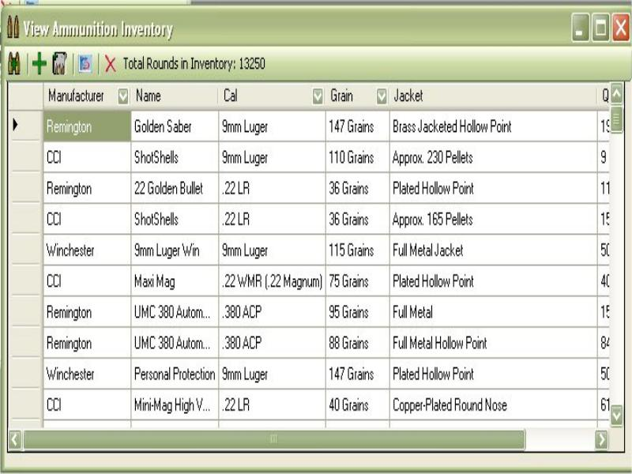
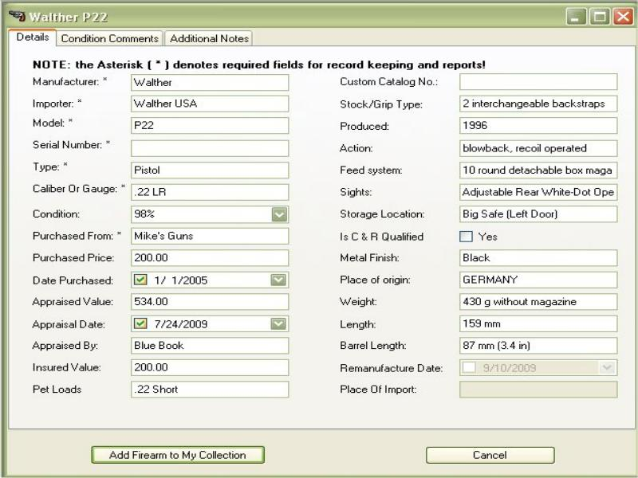
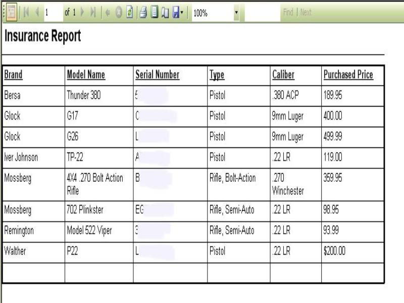
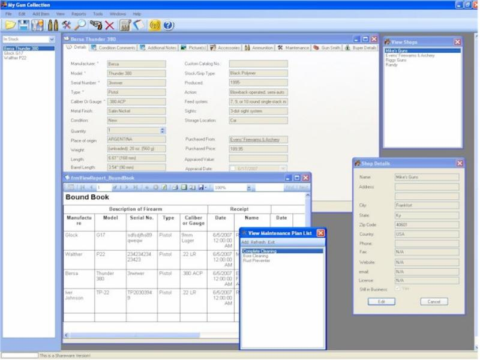
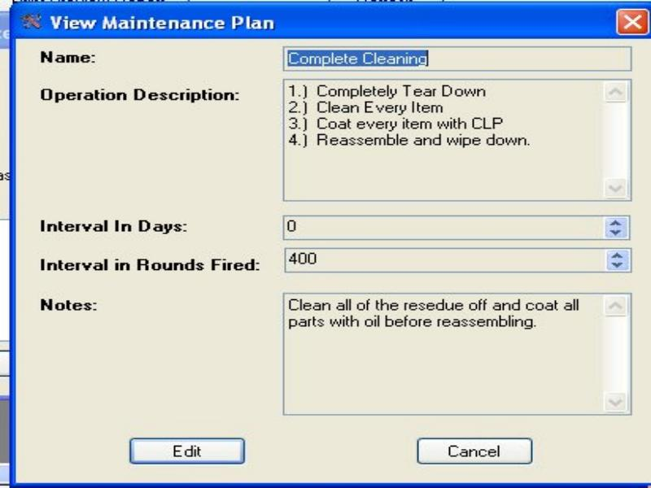
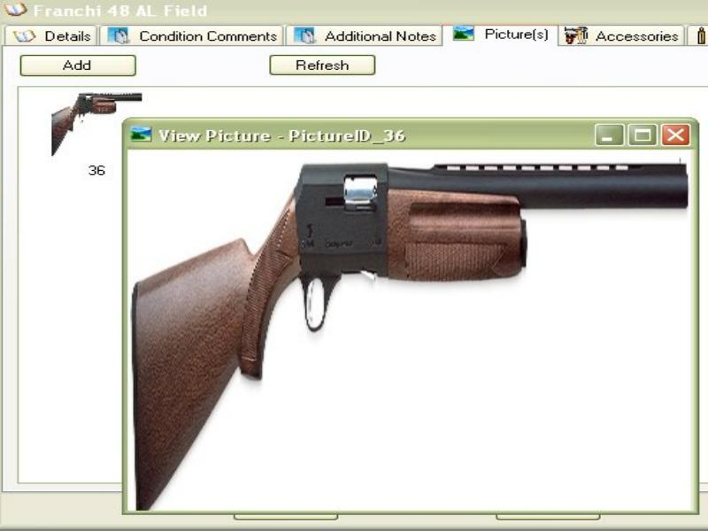
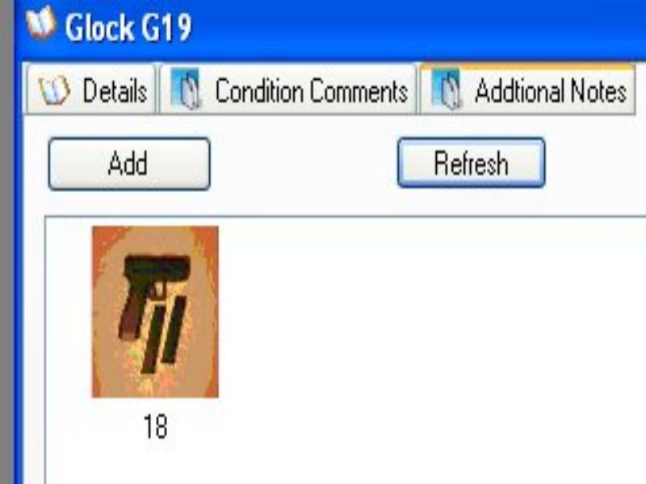
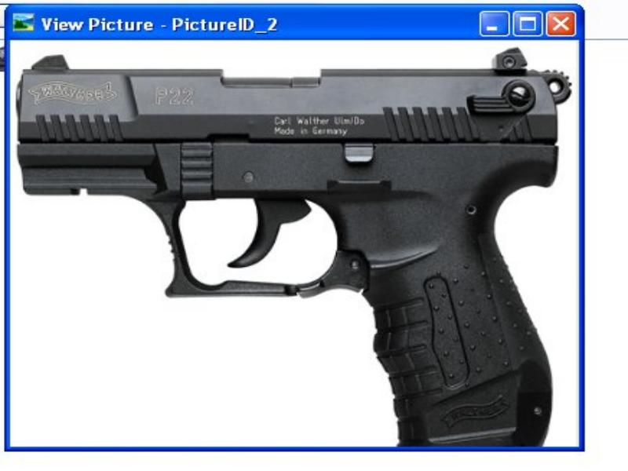
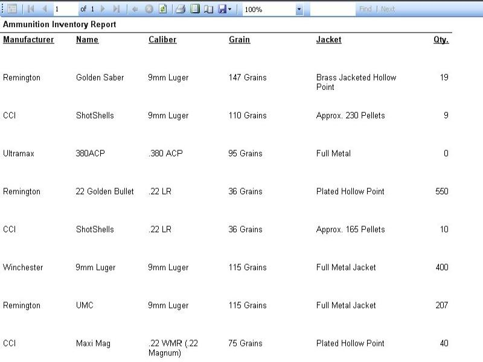
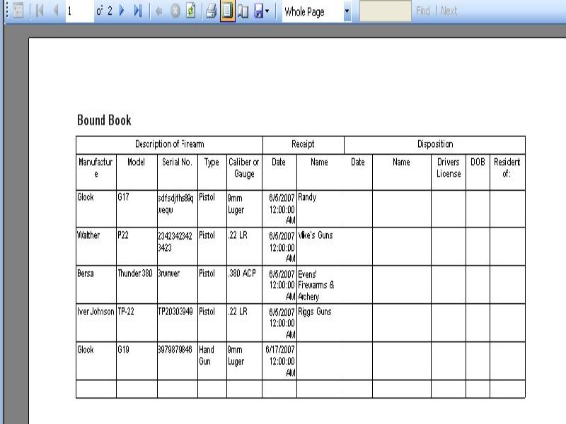
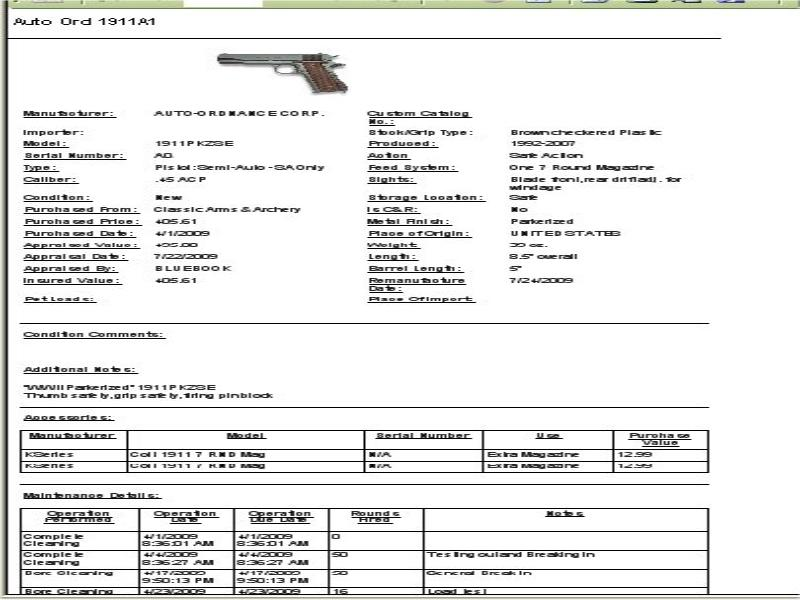
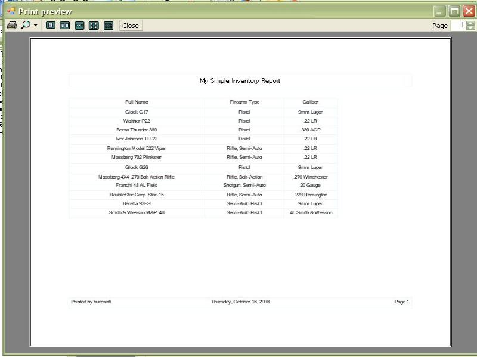
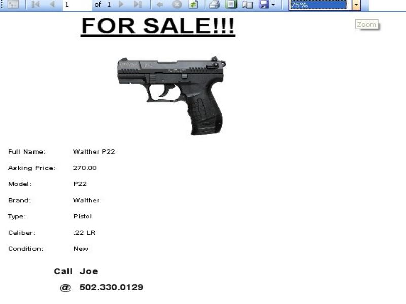
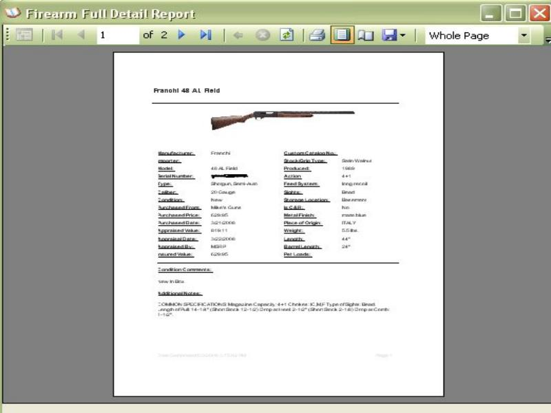
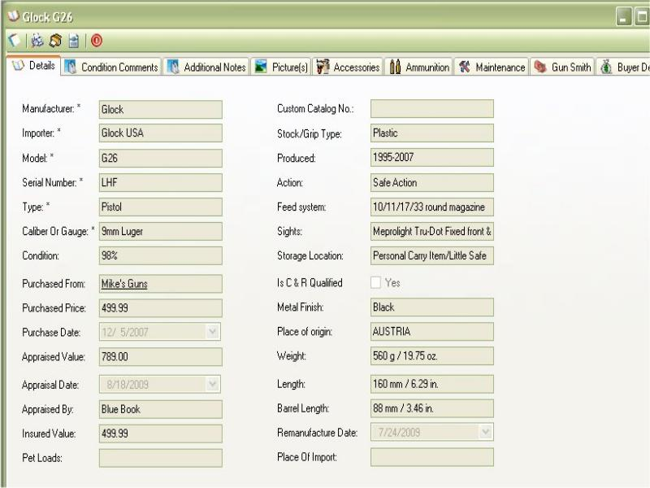
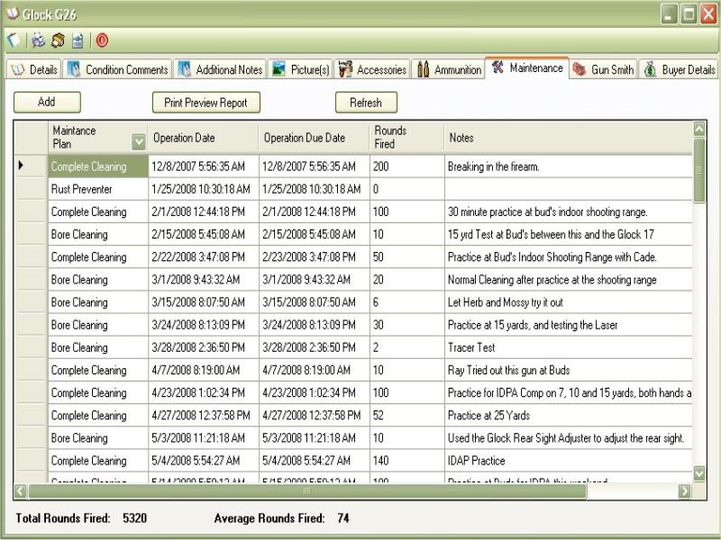

## Release Notes:

v6.5  March 2021

- Release as 100% Free, no longer a pay app
- Spell Checked