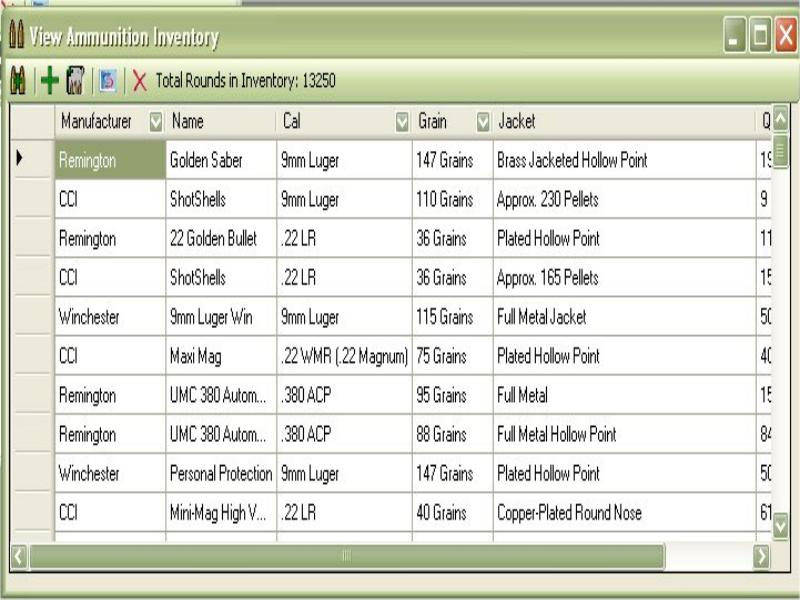
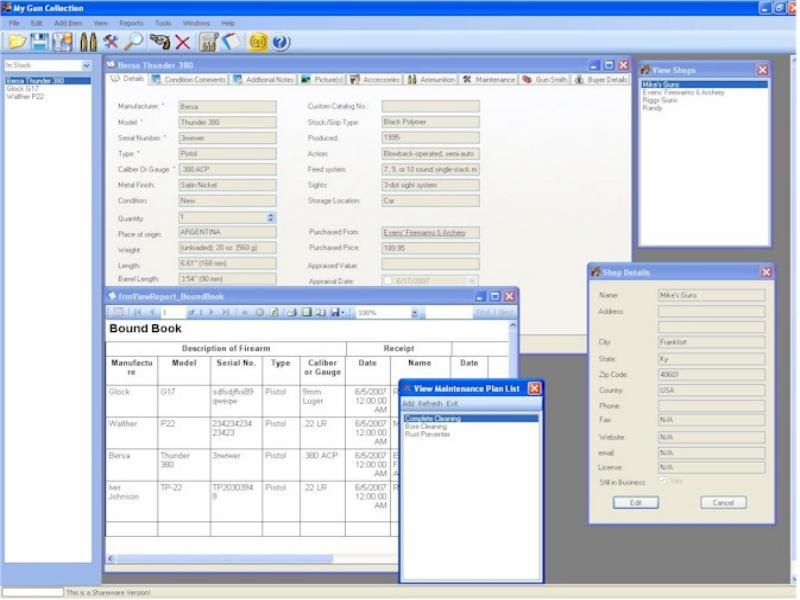
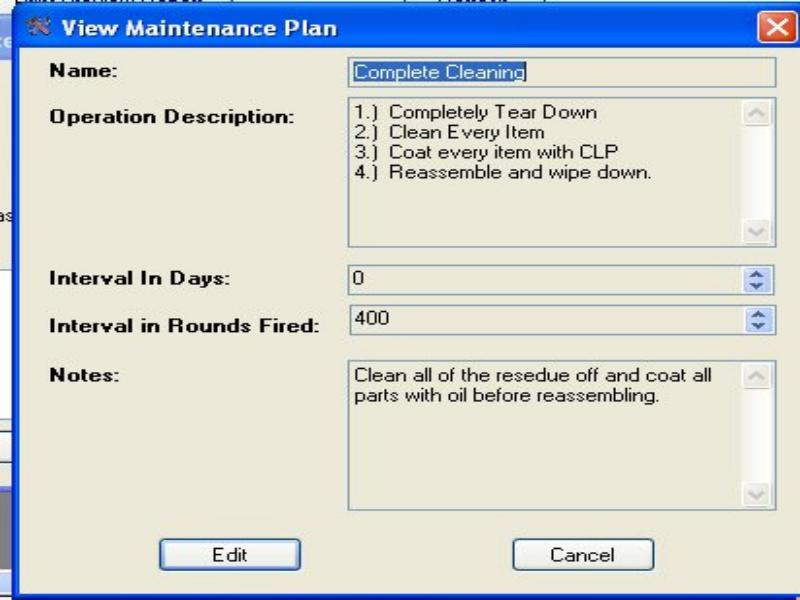
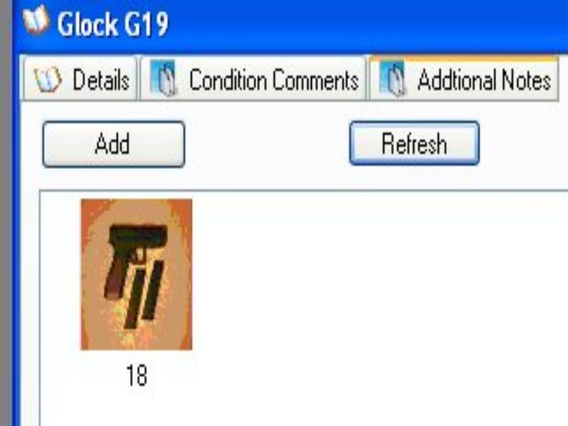
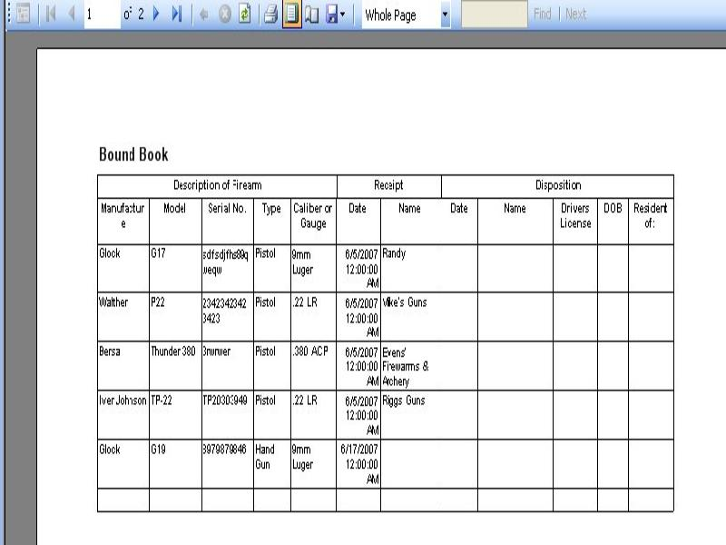
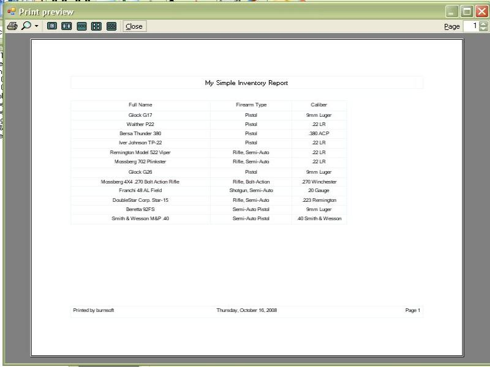
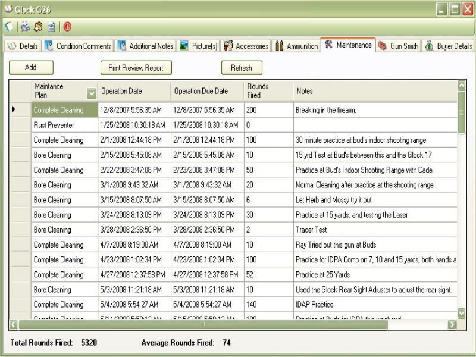

# My Gun Collection

The My Gun Collection (MGC) application was create back in 2007 to help manage your gun collection.  The My Gun Collection application was carefully designed to allow you to quickly get details about a specific firearm all with the click of the mouse.   With an easy to Use interface - the firearms in your collection are listed on the side of the application sorted by the Name alphabetically.  You have the option to view all the firearms in stock, the ones you sold or by all.  It has the ability to save data entry time by using an auto suggest feature for common information (Manufactures, Models, stores, caliber, etc.).

Print out reports such as: BATFE C&R (Curio and Relic) Bound Book Report, Quick Firearm Inventory Report, Ammunition Inventory Report, and For Sale Flyer.  Keep track of the cost and value (both appraised and realized) of your collection.  Easy to use Backup and Restore Applications are provided with this application.  The Pictures that you provided will also be backed up.

Over all, whether or not you have a huge gun collection or just a few firearms on hand, this application can help you keep track of useful information for your own personal gain, and even BATFE standards for reports and record keeping. 

]

## Gallery

## Additional Information

If you are working or updating this project, please use the [Developer Notes](apidocs/README.md) for help.
Any New Pre-Release code will be in the *develop* branch, if you want to see if this project has been updated recently.

## Release Notes:

### v7.1.19.85-RC1

* FIXED - Issue with Barrel Systems Display when only the default is present.  This Tab was suppose to only display if there is more than 1 barrel present and the default is added in the table by default just incase more barrels are added later.
* UPGRADED - Upgrade .Net Framework from 4.7.2 to 4.8.1
* Optimized how the data pulled for the View Firearms Window
* Fixed issue with C&R date when you edit a firearm.  If this was not set before, when you edit a firearm it will enable the C&R date and set a new date when you apply your changes.  Fixed it where it doesn't come up as enabled when you edit a firearm that is not a C&R Firearm.
* FIXED - Issue when you add a new firearm, if the Model ID does not exist, then it is not added and links the ID as 0.  Added if the model does not exist then to add it and get the ID to link
* FIXED - Issue with custom catalog ID when you edit a firearm, it was reporting that it existed and would display the firearm that you are editing.  Now it will detect that this is one in the same and not bother you with it.
* ADDED - Rating System per Firearm plus sorting in collection list.  Might make it easier to get rid of guns if you remember you didn't like them.
* FIXED - Issue with viewing a document and it would save in a protected directory instead of the writable data path.
* ADDED - The Ability to set the order of the pictures displayed for the selected firearm.
* ADDED - Sort Option for In-stock By Purchase Date
* ADDED - Sort Option for Sold/Stolen by Date Sold
* UPDATED - Sort order of Custom ID's to put the ones that have a custom ID at the top in descending order and the ones that don't have anything at the bottom.
* ADDED - [General Accessories Section](docs/help/GeneralAccessories.md) with ability to Attach to one or more firearms.  This section is the General Section for Misc Accessories that you have that can be used for anything or any firearm.  So extra mags scopes, lights, etc you can store here and attach to the firearm if you want but manage it from the Main section.
* ADDED - Barrel System Raw Data View - this way you can view all the Barrel systems in the database and manually edit things if you had to.
* FIXED - Issue with default barrel system maintenance showing for the selected firearm 
* ADDED - Included the Firearm ID in the window title when you click and view a firearm.
* ADDED - Main Library Version to the About Window for support
* ADDED - General Accessories Report
* UPDATED - Reports to newest version and adjusted margins
* UPDATED - Window size for reports where adjusted to be used on todays larger monitors.
* ADDED - New Option to Mark a Firearm that is ready or in the process of being sold, in the Gun Details Window
* ADDED - New Option to Mark a Firearm that is a Gun Smith Project that you are working on and will return to owner once down in the Gun Details Window
* ADDED - Drop Down Option for the new Feature os Firearms Ready to Sell and Gunsmith Projects
* ADDED - Options to both bound books with the ability to only show Firearms that where sold, gunsmith projects or are ready for sale.
* ADDED - New Calibers to Caliber List Table: 6.8x51mm SIG Fury, 7 PRC, 6mm ARC, 6.8 Western, .30 Super Carry, 25 RPM, .350 Legend, 6.5 PRC, and 6mm Creedmoor
* ADDED - The Ability to Mark a Firearm as in a Collection, meaning that this is something that is just to collect value and is hardy shot or easily sold.
* ADDED - Hot fix 11 to Update the Database
* ADDED - The ability to select the filters that you mostly use, so if you just use InStock, Gunsmith and Sold then you can just have those options in the list. For more information you can view the online help [Firearm Category Filter List](docs/help/FirearmCategoryFilterList.md)
* ADDED - New Option in Bound Books 1 and 2 to only print the items that are lethal and In Stock.
* FIXED - The ability to change the Title in the Bound Book 2 Window.

### v6.9.15.2 September 2022

* FIXED - Issue with when you have login Enabled
* FIXED - Issue with updates constantly asking you to apply when  you already applied.

### v6.9.14.1 August 2022

- Optimize functions by converting a lot of the code to use a separate library
- FIXED - Custom Catalog Sorting issue - Items sold or stolen showed up in the sort list.
- ADDED - The ability to Mark a Firearm as a Competition Gun and The ability to view all firearms with this Marker in the list
- ADDED - The ability to mark a device as a Non-Lethal Weapon and the ability to view all of these devices in the list.  Since things like the byrma and taser have serial numbers and some people have these as an option when visiting other states.
- OPTIMIZED - Hot fix Updater to not use a separate application which windows would complain about.  Now it is all part of the app.
- UPDATED - Mixing fields in Import and Export Functions.
- ADDED - Preloaded data with information that was an option that was loaded in By the Data Loader.
- REMOVED - The Data Loader application.  This application was the only one that went out to the web to get the data, now that the database has all the information pre loaded, this application is no longer needed.
- FIXED - Glitch in Audit Ammo in version 6 release, the settings was not saving a properly loading when the app started
- UPDATED - Wording and Spelling.
- ADDED - Before when you used the ammo calculator to subtract the rounds you used with the count in your inventory, it will now append how much of that ammo was used in the maintenance window.

### v6.5  March 2021

- Release as 100% Free, no longer a pay app
- Spell Checked