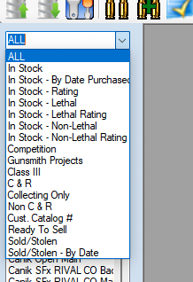
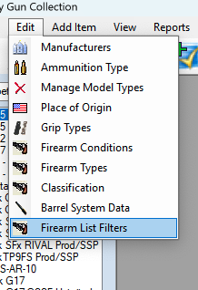
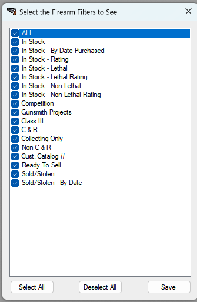
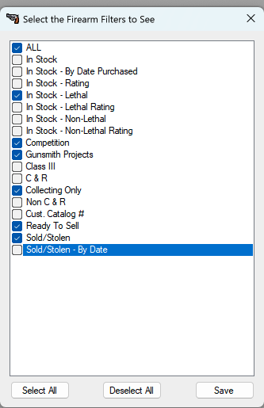
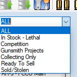

# Firearm Category Filter List

Another New option in version 7 is the ability to Filter Out the options in the Drop Down Menu for the Firearms Filter.  
Since the last version there have been extra options added to the list to be able to filter out items.  

But while Testing against my Collection, I realized that others and myself might not care about all the options and wish to simplify things.

So To Simplify things, I created the option to take out the Filters that you are not interested or become interested in.

In the top menu, Just Click on “Edit | Firearms List Filter”

Since everything is already selected by default the window will look like the one you see below

Just Double click on the Checkbox to unselect or select the item you want to remove or keep.

In the picture above, I was only interested in keep a few.  Once you have the items you want, click on the **Save** button.

Once the Window closes the DropDrown list will refresh and you can now only see the items that you had selected in the filter list.

