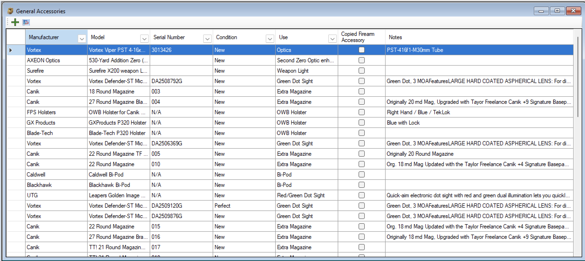
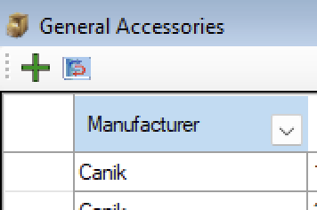
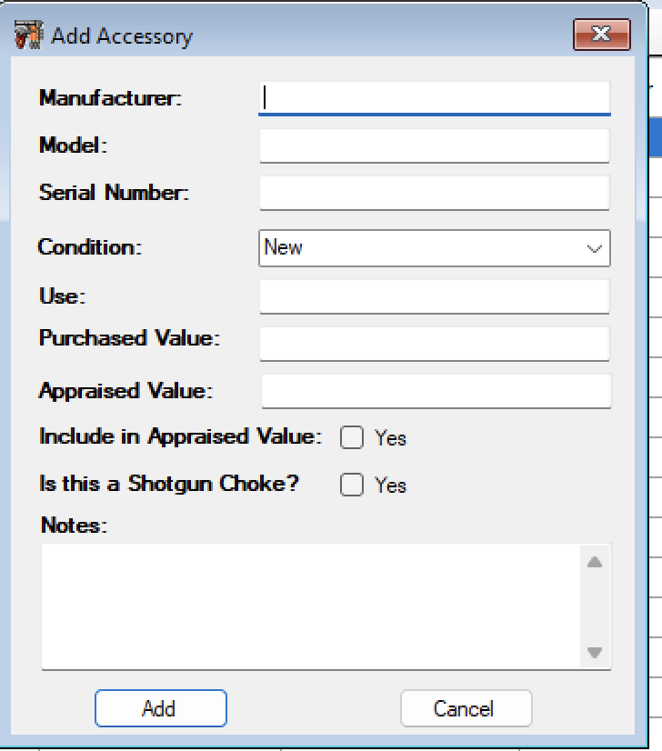
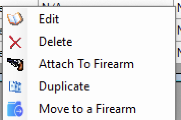
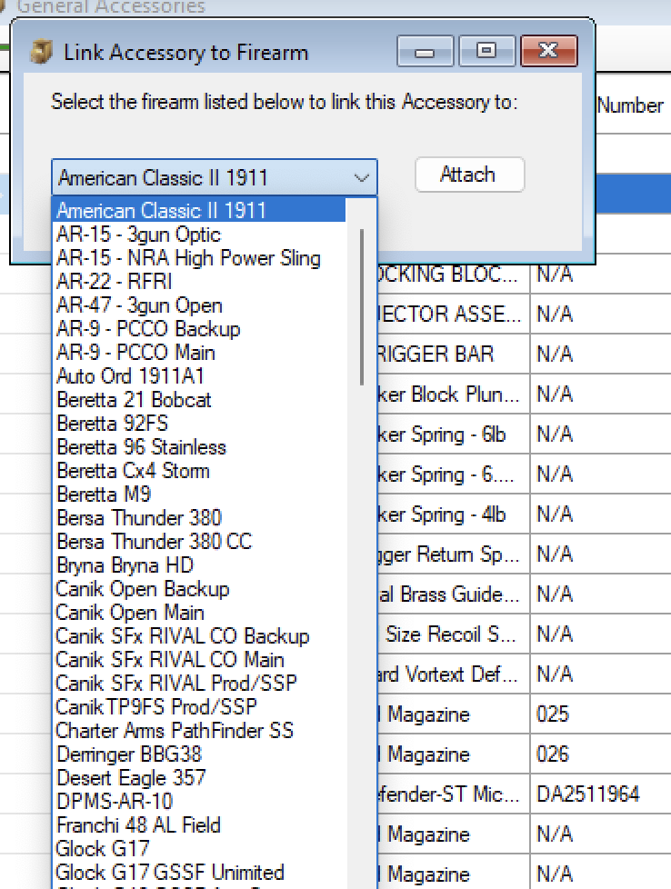
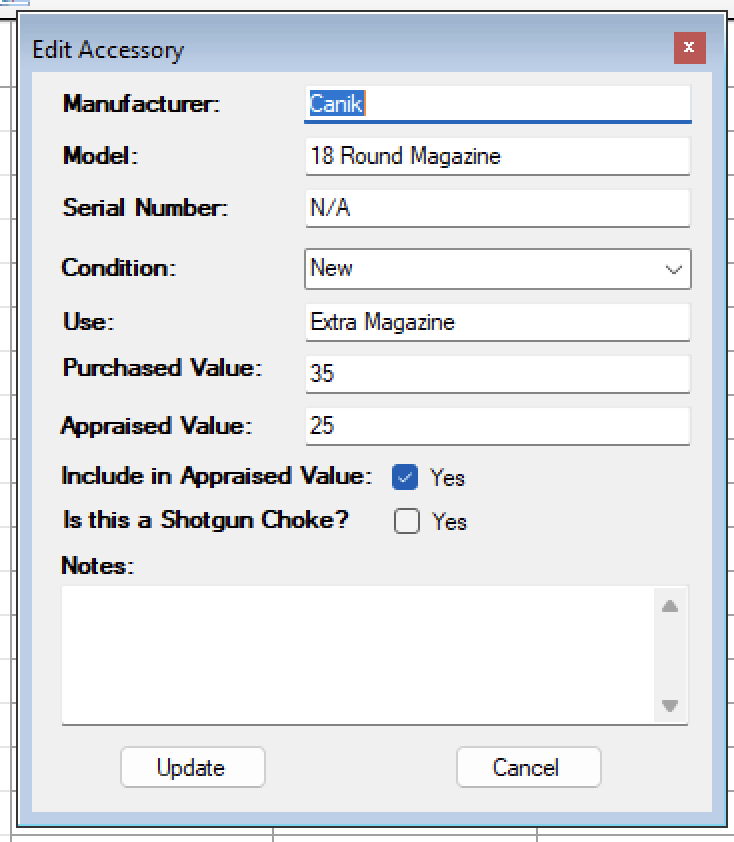
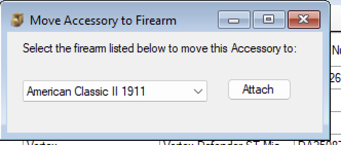

# General Accessories

The General Accessories feature was created in version 7.  This is a central location for accessories that is used against multiple firearms or something that you are keeping in your personal inventory to replace something in the future or to add to a future firearm.  

This is Separate from the Firearm Accessories since There are things that will come and/or sell with a firearm, And then there are things that will not since it is also used with another firearm that you do not intend to sell.

Like Scopes, Red Dots and Extra Magazine.  I Tend to have older scopes lying around because I upgrade the scope that was used on the firearm so the scope is stored later on incase I get a rifle that needs a scope or if something breaks.

Same with Red Dot Optics, I have a spare Just in case one of the others break and I have to send those off to get fixed, in the mean time I can put on the new/extra red dot optic and continue to use that gun.  Or If I get another firearm that I want an optic on, I have a spare and can just put it on that.

Magazines are the same, you can have 20 mags that you bought separate from a firearm, but you have a few guns that those magazines can be used in.  So you can keep track of them in the General Accessories

Granted, you don’t have to keep it separate, if you mostly live in the firearm accessory section, you can link an accessory from the general accessories to a firearm(s).

This will create a copy of the details from the General to the Firearm accessories.  However if you edited the General Accessories that change will also update the details for the linked accessories in the firearm accessories.

You can delete it from the Firearm accessory and not affect the general inventory.  But if you deleted it from the general it will delete against all the linked firearms.  If you wanted to permanently attach it to a firearm, then you can just move it.

## Add a New Accessory

To add a new General Accessory, Open up the general Accessory section if it is not already open up.
In the top left tool bar, there is a Plus sign, click on that

A new window will appear.

Fill out the information as you see fit.  Once you are done click on the **Add** Button.

## Attach a General Accessory to a Firearm

To attach a General Accessory to a Firearm.  Select the accessory that you are interested in and Right click to pull up the menu.

Select the **Attach to Firearm** menu option.

Now another window will appear that will allow you to select the firearm that you want to attach the accessory to.

Select the firearm from the list, and click on the **Attach** button.

Next it will ask you if you want to attach it to another firearm.  If you click on **yes** then repeat the process.  If you click on **No** it will close the window.

Easy right?

## Create a Duplicate of an Accessory

Well on some things you have multiples on, like Optics, and Magazines, but you don’t want to type in 3 separate entries for the 3 magazines you just bought.  If you already have one of them listed in the general accessories, then. You can duplicate an existing one to help update the count that you have.

If something was different like a serial number, then you can duplicate the accessory and the edit it.

To use the Duplicate function, just select the accessory that you want to create a copy of and right click to bring up the menu.

Click on the **Duplicate** menu option and that it is.
The list will refresh and you will see at the bottom of the list and new entry that looks like the one you copied.

## Edit an Accessory

To Edit and Accessory, just select the accessory that you need to edit
Right click on the item
The select **Edit** from the menu.

Once the Edit Window Appears, make the changes that you need to make and click on the **Update** button.

## Move to a firearm

To Move a General Accessory to a Firearm.  Select the accessory that you are interested in and Right click to pull up the menu.

Select the **Move to Firearm** menu option.

Now another window will appear that will allow you to select the firearm that you want to move the accessory to.

Select the firearm from the list, and click on the **Attach** button.

The Window will disappear that the selected accessory in the general section will not longer exist there, it will be int he firearm accessory section.

## Delete

If you needed to delete an accessory from your collection, just select the accessory in the list and right click on it to bring up the menu.

Click on the **Delete* option.  It will as to make sure that you wish to delete it from the database.

If you click on Yes it will delete it from the general Accessories and all the firearms accessories that it was linked to.

