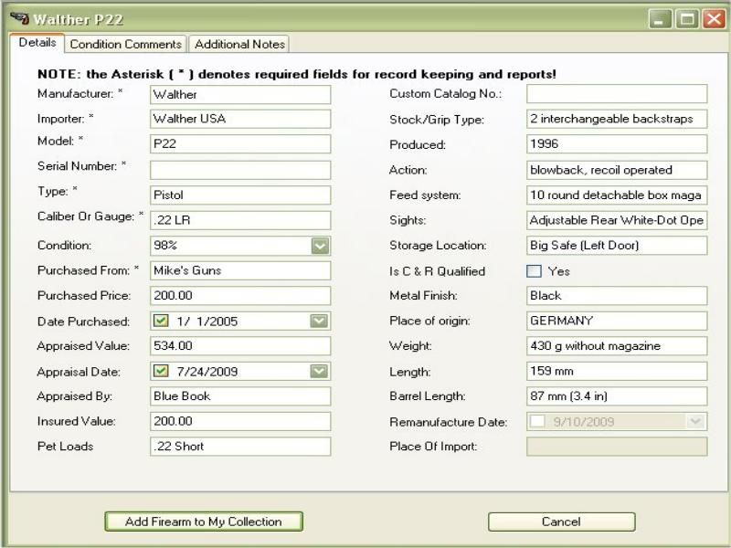
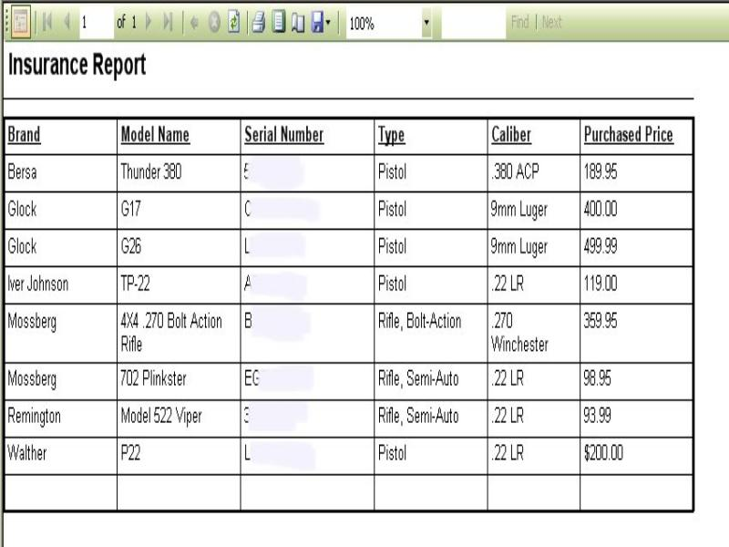
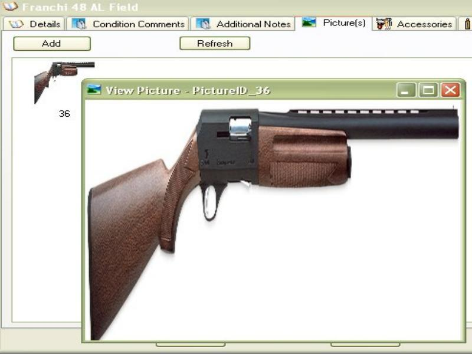
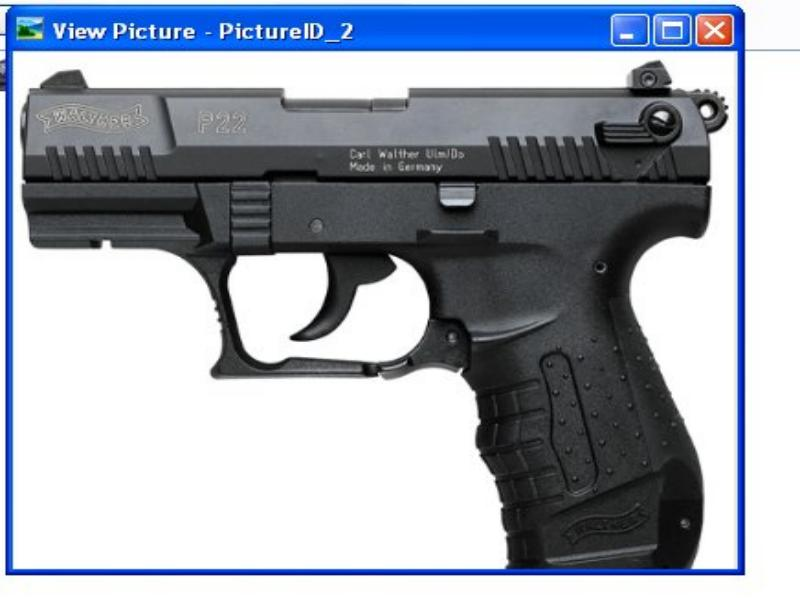
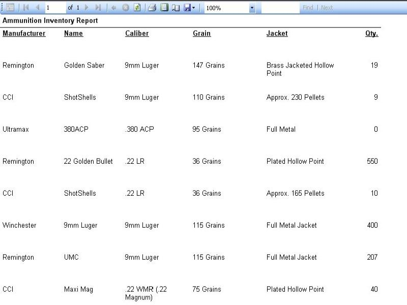
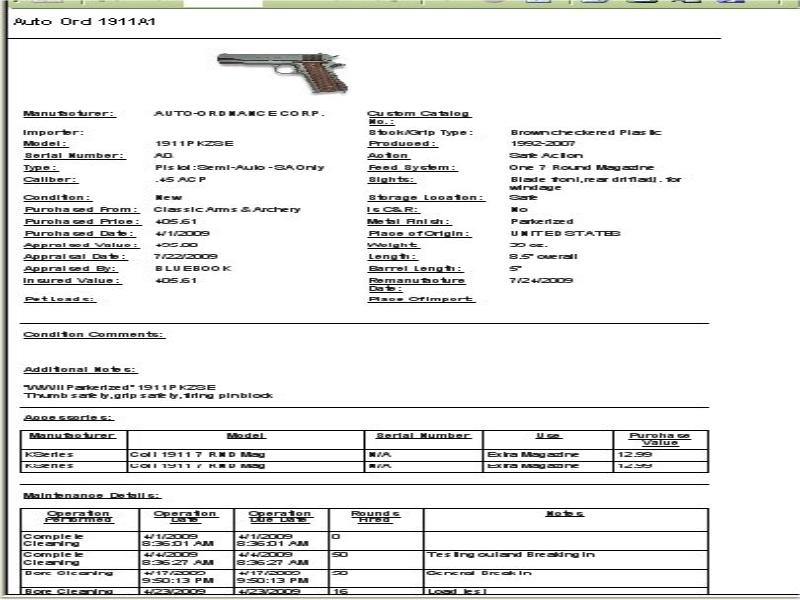
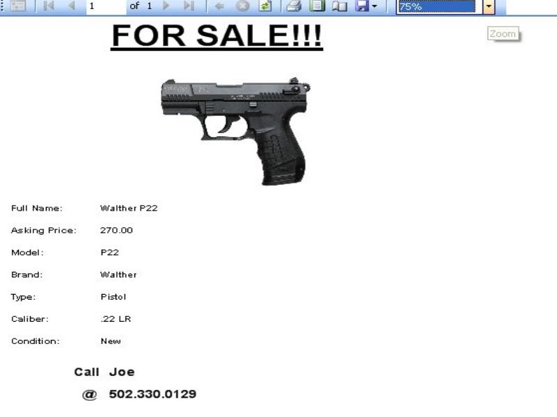
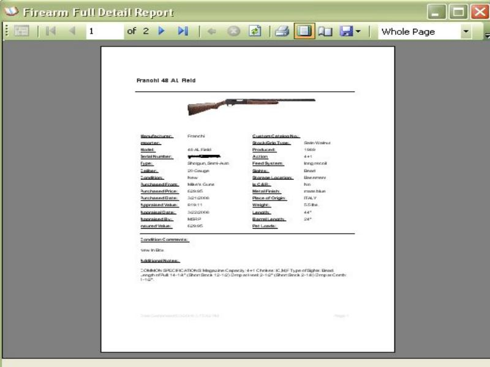
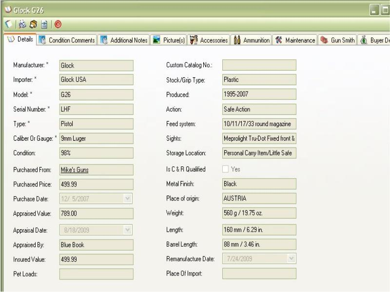

# My Gun Collection
The My Gun Collection (MGC) application was create back in 2007 to help manage your gun collection.  The My Gun Collection application was carefully designed to allow you to quickly get details about a specific firearm all with the click of the mouse.   With an easy to Use interface - the firearms in your collection are listed on the side of the application sorted by the Name alphabetically.  You have the option to view all the firearms in stock, the ones you sold or by all.  It has the ability to save data entry time by using an auto suggest feature for common information (Manufactures, Models, stores, caliber, etc.).

Print out reports such as: BATFE C&R (Curio and Relic) Bound Book Report, Quick Firearm Inventory Report, Ammunition Inventory Report, and For Sale Flyer.  Keep track of the cost and value (both appraised and realized) of your collection.  Easy to use Backup and Restore Applications are provided with this application.  The Pictures that you provided will also be backed up.

Over all, whether or not you have a huge gun collection or just a few firearms on hand, this application can help you keep track of useful information for your own personal gain, and even BATFE standards for reports and record keeping. 

[](https://www.paypal.com/cgi-bin/webscr?cmd=_s-xclick&hosted_button_id=JSW8XEMQVH4BE)]

## Gallery


















## Release Notes:

v6.9.15.2 September 2022

* FIXED - Issue with when you have login Enabled
* FIXED - Issue with updates constaly asking you to apply when  you already applied.

v6.9.14.1 August 2022

- Optimize functions by converting alot of the code to use a seperate library
- FIXED - Custom Catalog Sorting issue - Items sold or stolen showed up in the sort list.
- ADDED - The ability to Mark a Firearm as a Competition Gun and The ability to view all firearms with this Marker in the list
- ADDED - The ability to mark a device as a Non-Lethal Weapon and the abilit to view all of these devices in the list.  Since things like the byrma and tazer have serial numbers and some people have these as an option when visiting other states.
- OPTIZIMED - Hotfix Updater to not use a seperate application which windows would complain about.  Now it is all part of the app.
- UPDATED - Mixxing fields in Import and Export Functions.
- ADDED - Preloaded data with information that was an option that was loaded in By the Data Loader.
- REMOVED - The Data Loader application.  This application was the only one that went out to the web to get the data, now that the database has all the information pre loaded, this application is no longer needed.
- FIXED - Glitch in Audit Ammo in version 6 release, the settings was not saving a properly loading when the app started
- UPDATED - Wording and Spelling.
- ADDED - Before when you used the ammo calculator to subtract the rounds you used with the count in your inventory, it will now append how much of that ammo was used in the maintenance window.

v6.5  March 2021

- Release as 100% Free, no longer a pay app
- Spell Checked


Text can be **bold**, _italic_, or ~~strikethrough~~.

[Link to another page](./another-page.html).

There should be whitespace between paragraphs.

There should be whitespace between paragraphs. We recommend including a README, or a file with information about your project.

# Header 1

This is a normal paragraph following a header. GitHub is a code hosting platform for version control and collaboration. It lets you and others work together on projects from anywhere.

## Header 2

> This is a blockquote following a header.
>
> When something is important enough, you do it even if the odds are not in your favor.

### Header 3

```js
// Javascript code with syntax highlighting.
var fun = function lang(l) {
  dateformat.i18n = require('./lang/' + l)
  return true;
}
```

```ruby
# Ruby code with syntax highlighting
GitHubPages::Dependencies.gems.each do |gem, version|
  s.add_dependency(gem, "= #{version}")
end
```

#### Header 4

*   This is an unordered list following a header.
*   This is an unordered list following a header.
*   This is an unordered list following a header.

##### Header 5

1.  This is an ordered list following a header.
2.  This is an ordered list following a header.
3.  This is an ordered list following a header.

###### Header 6

| head1        | head two          | three |
|:-------------|:------------------|:------|
| ok           | good swedish fish | nice  |
| out of stock | good and plenty   | nice  |
| ok           | good `oreos`      | hmm   |
| ok           | good `zoute` drop | yumm  |

### There's a horizontal rule below this.

* * *

### Here is an unordered list:

*   Item foo
*   Item bar
*   Item baz
*   Item zip

### And an ordered list:

1.  Item one
1.  Item two
1.  Item three
1.  Item four

### And a nested list:

- level 1 item
  - level 2 item
  - level 2 item
    - level 3 item
    - level 3 item
- level 1 item
  - level 2 item
  - level 2 item
  - level 2 item
- level 1 item
  - level 2 item
  - level 2 item
- level 1 item

### Small image


### Large image


### Definition lists can be used with HTML syntax.

<dl>
<dt>Name</dt>
<dd>Godzilla</dd>
<dt>Born</dt>
<dd>1952</dd>
<dt>Birthplace</dt>
<dd>Japan</dd>
<dt>Color</dt>
<dd>Green</dd>
</dl>

```
Long, single-line code blocks should not wrap. They should horizontally scroll if they are too long. This line should be long enough to demonstrate this.
```

```
The final element.
```
