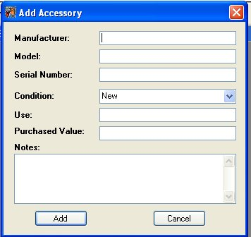
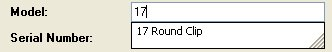
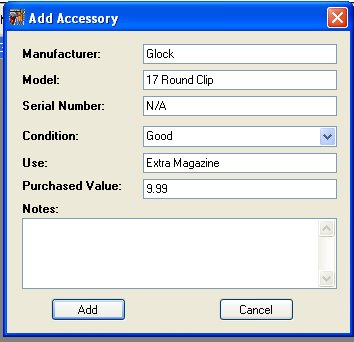

# Adding Accessories

When Click on the **Add Accessory** button from the firearm Details window, the following window will appear:

The Manufacturer and the Model have the same auto suggest feature that is available when you are adding a Firearm, Except that it is going off what is already listed in your accessories section. 

This method was used to help with any extra accessories that you have that are the same, like clips or Magazines, most gun owners will have more then one Magazine for there hand gun or rifle.

You can fill in all the fields or just the Manufacture and Model

Once you are finished, click on the **Add** button to Add it to your Collection for that firearm.

If it doesn't display in the Accessories window after you have added it, just click on the **Refresh** button to reload the grid.