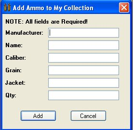
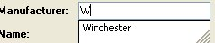
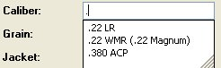
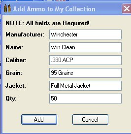
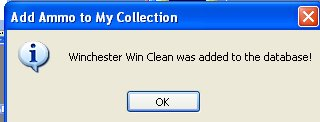

# Adding Ammunition

You can add ammunition to your collection by clicking on the **Add** button in the Ammunition section when you are viewing the details of the firearm, or you can also add ammunition to your collect by going to the **Add Item** on the Menu Bar, and clicking on the **Add Ammunition to my Collection**.  Once you click on any one of those methods, the following window will appear.

Just like when you are adding an accessory to your firearm, all the fields in the window will use the Auto suggest feature for all the fields except the "Qty. Field.   All you have to do is type in the first character of the word, and it will give suggestions based on what is already in the database.

Once you have all the information filled out, click on the *Add* button to add that information to the database for it to show up for the firearm that uses that kind of caliber/gauge and in the Ammunition Inventory Section as well.

**NOTE:  IF YOU HAVE THE AUDIT AMMUNITION PRICES ENABLED IN YOUR SETTINGS, YOU WILL BE ASKED FOR THE PRICE THAT YOU PAID FOR THE AMMUNITION.**

You will get a message stating that the information was added to the database, just click on the *Ok* button to exit that window.

