# Adding Barrel or Conversion Kit to a Firearm

Here is a regular view of an AR-15 with both .223 and 5.56 calibers listed, this is what you currently see in the regular version.

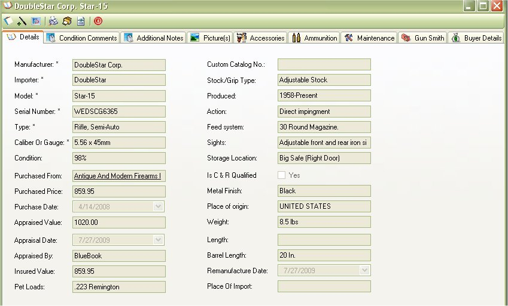

On the tool bar, the second icon from the left will have a new button that will allow you to add a barrel or conversion kit to the current firearm.

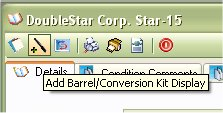

It will close out the view, and bring up another window with a form for you to fill out. As you can see some information from the current firearm was copied over to the form. Which of course of that information did change then you can change it manually.

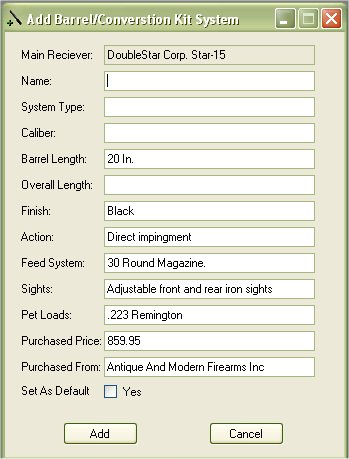

In this example we are going to add a .50 Beowulf upper to the AR.

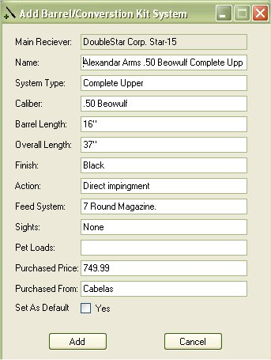

As you can see the caliber changed, the barrel length and overall length changed, the feed system, sights, price and store location where
changed as well. (The price and location will not change in the main view at this time)

Once you are finished you click on the Add button, and it will bring up the view of the firearm you were last looking at.

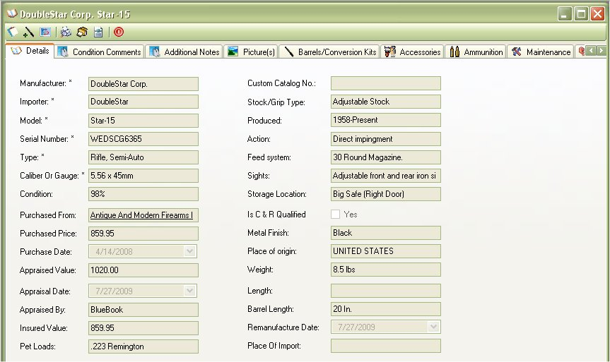

Since I did not select it as the default system, it kept the old information intact. However you should notice a new tab is displaying called
"Barrels/Conversion Kits", when you click on this tab it will show you the barrels and conversion kits that you have for this firearm including the
default barrel.

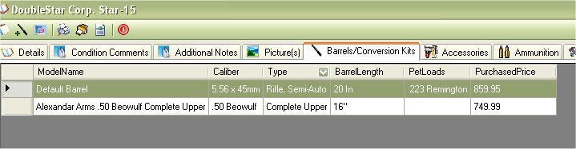

Maintenance and the Gun Smith section for this Barrel/Conversion Kit you will need to select it as default.

## Setting the default Barrel/Conversion Kit

Just click on the system a right click to
bring up a menu, and select "Set as Default"

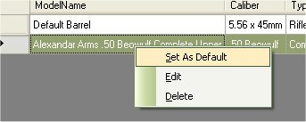

When the information refreshes for the firearm it will change some of the information in the details view.

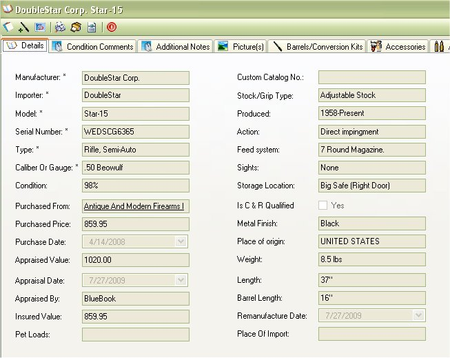

Now such things as the Ammunition, Maintenance, and GunSmith section has been updated to accommodate the new system.

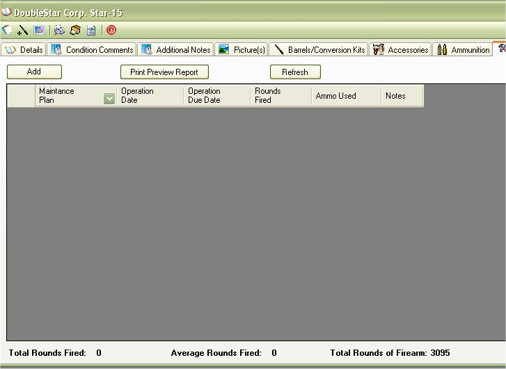

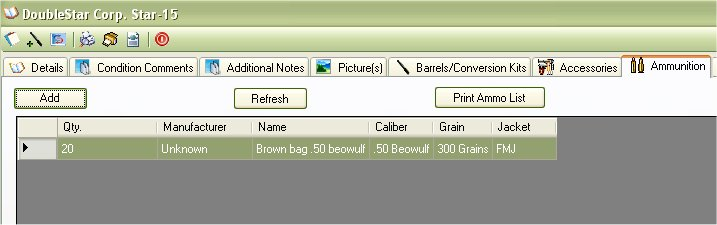

As you can see in the maintenance picture above The Total Rounds Fired and Average rounds fired are at 0 since there are no entries for this
upper. but in the fire right corner there is a new tag called "Total Rounds of Firearm:" which has the total of all the rounds fired with the default
system and any barrel or conversion kits that are used on this firearm.

This was a major update to get this in place and we are still adding it to all the little bits and pieces of the application to make sure everything
works. So it's been taking awhile to complete.

And Here is a quick shot of how it looks in the final report:

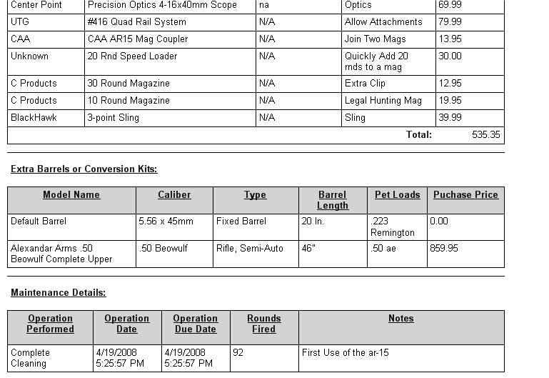

