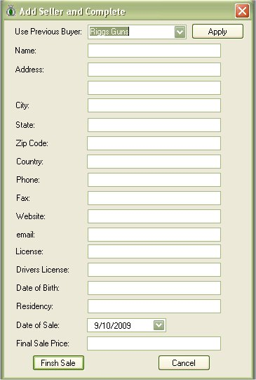
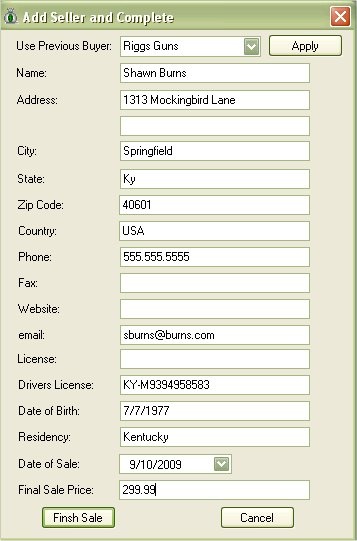
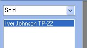
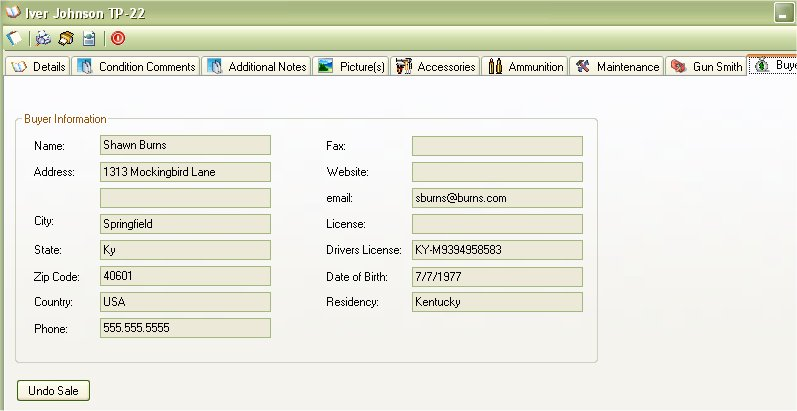

# Adding Buyer Information

When you click on the *Mark Item as Sold* from the details window of the selected firearm, it will bring up the following window:

Fill In the Information listed, for your safety, we recommend that you fill out all the information, just in case local or federal law enforcement need that information just incase this weapon was used in a crime in the future.  That firearm can be traced back to you if you purchased it through a local gun shop, therefore, if you turned around and sold it to someone else, at least you can say that this firearm was sold to this person, on this date, and here is the information that I have from that person at that time.

If this is a person or store that you have sold firearms to in the past, then Select them from the Use Previous Buyer list and click on the *Apply* button to have it auto fill the information.

Once you have all the information filled out, click on the *Finish Sale* button to mark this firearm as sold.

The Side list will refresh and the firearm that you just sold will now appear in the "Sold" section of the firearm list.

You can still double to view the information for that firearm, if you go to the *Buyer Details* section you will noticed all the fields will have information about the person that bought this firearm.

Just in case you were testing this function out, or that you got the gun back from the person, you can click on the *Undo Sale* button to put this item back in your collection and remove the buyer from this firearm.
