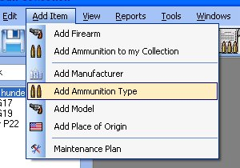
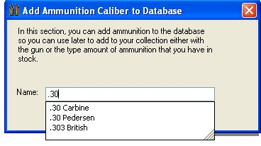
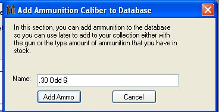
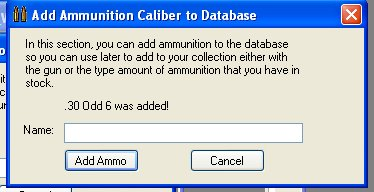

# Adding Ammunition Type

This is another feature to help with the Auto Suggestion when you are adding a new firearm or adding ammunition to your collect.  This will allow you to add in the Caliber or gauge that you have or want to put in the database.  The Ammunition type is very important in this application since you ammunition inventory will also tie in with the ammunition that your firearm requires.  We currently have 118 different kinds of Ammunition listed in the database.

To Add Ammunition Type, just click on *Add Item* on the menu bar, then click on *Add Ammunition Type*.

Just type in the Caliber or Gauge in the text box, if it already exists it will try to suggest it.

Once you are finished typing in the type, click on the *Add Ammo* button to add the Caliber to the database.  When it is added you will notice this message above the name text box.

