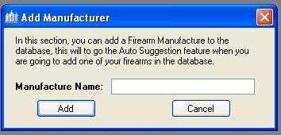

# Adding Manufacturers

This feature was added for those that have a huge collection of firearms from the same or other manufactures.  This feature will allow you to enter in the manufactures in the database, this list is mostly used when you are adding a firearm to your collection, is it part of the Auto Suggest feature.  If the manufacture does not exist when you are adding a firearm, it will still add the Manufacturer to the list for future use.  So this feature might be useless for most users.  Currently we do have about 66 manufactures listed in the database.

To just add Manufactures to the database, just click on the *Add Item* on the menu, and then click on *Add Manufacturer*.  Once you do this the following window will appear:
  

Just Type in the Name of the Manufacturer and click on the Add button.

Just click on the *Ok* button on the message box to add another manufacturer or to exit that window.

  
  