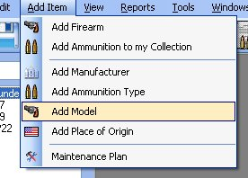
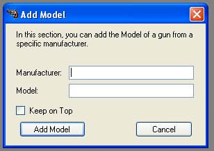
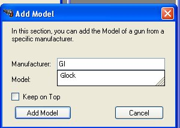
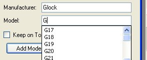
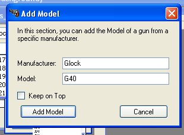
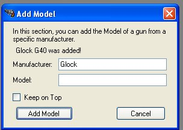

# Adding Model

The Model feature was added to complement the Manufacturers Information.  This also helps with the auto suggest when adding a firearm.  We currently have 118 models tied to 5 manufacturers.  This was another way to quickly Add firearms to your collection.

To add a model to the database, just click on *Add Items* and then click on *Add Model*

This also function just like the Add Manufacturers and Add Ammunition Type, when you start typing in the Manufacturer's field, it will start to suggest words that are already listed in the database.

Once you have entered in the Manufacturer, start typing in the Model from that manufacturer.  This section will also auto suggest words that are already listed in the database for that manufacturer.

Once you have entered in the Manufacturer and model, click on the *Add Model* button to add the Model to the database.

You will notice that the model you just added was displayed above the manufacture field stating that it was added to the database.  We Left the Manufacturer in just in case you wanted to add more models from that manufacturer or another manufacturer.  You can get the different type of models from the manufacturers website, if they are still in business.

