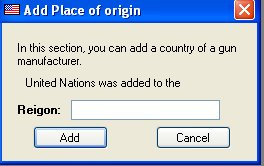

# Adding Place of Origin

Right now, the Place of Origin is an Auto Suggest feature that is used when you are entering a new or editing a firearm.  The Place of Origin is the country of the manufacturer.  We currently have 247 Countries entered in the database, so chances are you will not have to enter in anything new any time soon.

To add a new place of origin or country, just click on *Add Item* on the menu item, and click on A*dd Place of Origin*.

This window also has the auto suggest feature for countries that are already listed in the database.

Once you have the Region/Country entered in, click on the *Add* button to add this to the database.

The status will display above the Region text box.