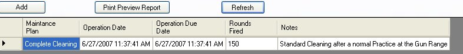
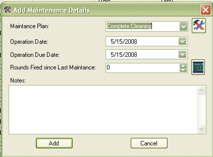
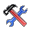
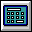
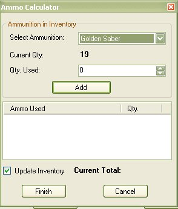
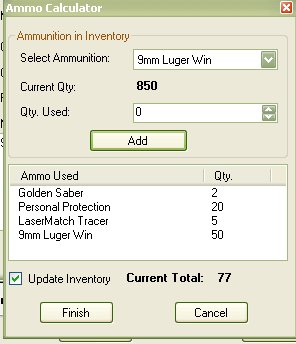
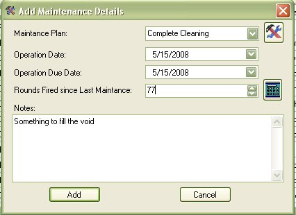

# Adding Maintenance Details

To Add Information, just click on the *Add* button and the top left of details window.  Once you click on that, the following window will appear.

## Selecting a Maintenance Plan

Select the Maintenance Plan that you performed on the selected firearm.  If you forget which maintenance plan is which, you can click on the the little tools icon (  )  to view the selected maintenance plan.

## Operation Dates

The Operation date can be used to mark when the firearm was used or when you started the selected maintenance.

The Operation Due Date is use for when the Maintenance was completed.

Once you have selected the Operations Date and Due Date, you can also select the number of rounds that you used since the last time that you performed maintenance on the selected firearm.

## Rounds Fired since last Maintenance

In Version 1 and 2 of the My Gun Collection application, if you used the maintenance plans as well as the Ammunition Inventory features, then when you had to add maintenance to a firearm after using it at the range and putting 100 round of practice rounds, plus a few ballistic tests, you would have to put the end total in the "Rounds Fired since last Maintenance" section, then you would have to go to the Ammunition Inventory section and Manually Subtract from the number there.  Took more time if anything.   But something new was released in version 3.x.

The Ammo Calculator was added to the version 3.x release.  If you do not wish to use this feature just skip to the *Notes* Section.

You can still do the old method if you wish, but if you wanted your Ammunition inventory to be updated as well, then you can use the ammo calculator by clicking on the calculator (    )   icon, which will bring up the following window.

As you know, if you have ammunition listed in the Ammunition Inventory, when you are viewing a firearm, it will pull all the ammunition from the ammunition inventory that matches the Caliber and Pet Load that is used and will display with the Details of the selected firearm.  The Same applies here, where it will list only the ammunition that matches that list.

All you have to do is select the brand of ammunition that you used, once selected it will display how much you have listed in inventory.

Type in the number of rounds that you used from that brand and Click on the *Add* button.

Repeat these steps until you have selected all that you have used for this firearm.

Once you have selected all the ammunition that was used, you can see that it keeping track of the total number of rounds that you used.

If you want the calculator to update you Ammunition inventory, make sure the "Update inventory" check box is selected ( it is on by default ).

Once you are finished, click on *Finish* button, to have the total number of rounds transferred to the maintenance window.

## Notes

The Notes section is more for your own use on why you where out on the range or what you where doing with that firearm.  It's just an added option for your own personal use.

## Finish

Once you are finished adding data, just click on the *Add* button add this information to the database for the selected firearm.  Once you click add, it will refresh the list for the firearm details, as well as update the Total Rounds Fired and Average Round Fired stats.