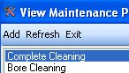
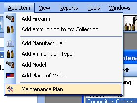
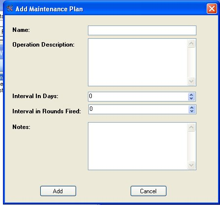
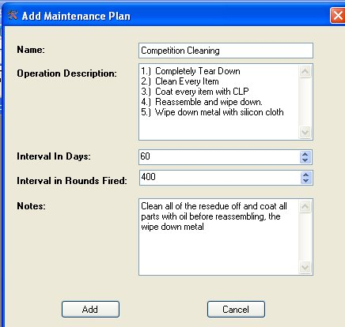

# Adding Maintenance Plans

There are two ways to add a maintenance plan, if you are currently viewing the *Maintenance Plan List*, you can just click on *Add* in the menu bar of that window.  You can also click on *Add Item* in the menu bar, and click on *Maintenance Plan*.

Once you click on the *Add* or the *Add Item* | *Maintenance Plan*, the following window will appear:

Just Fill in the Information for:

Name - The Title of the Maintenance Plan, this will be the only thing that appears when you are adding this plan to a firearm or while viewing the Maintenance Plan List.

Operations Description - This will include the steps that you would take for this plan.

Interval in Days - This is for normal maintenance that you would do if the firearm was not in use for x amount of days.

Interval in Rounds Fired - This is for normal maintenance if the firearm was using x amount of rounds.  Some would use this for a firearm that was used every time they went to a firing range.

Notes - This is additional notes to explain why this plan is performed.

Once you have all the details entered in, click on the *Add* button to add this plan.