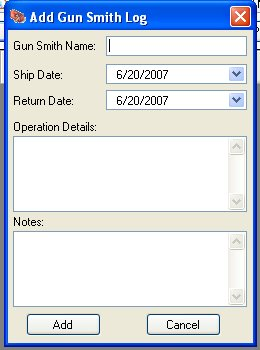
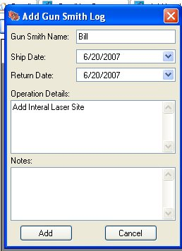

# Adding to the Gun Smith Log

When you click on the *Add to Gun Smith Log*, it will bring up the following window.

Type in the name of the Gun Smith or Shop that performed this operations.  Too easy this process, we have also added in the Auto Suggest feature on the name to allow you to select an existing Gun Smith or Shop.

Select the date that you sent it into the gun smith, and the date that it was returned.   In the Operation Details, type in what was done to the gun.

You can add any additional notes or comments in the *Notes*, just in case you are not pleased with the service or very pleased with the service.  It can also be notes that the gun smith gave you about what you might need to repair in the future.

Once you have the information filled out, just click on the *Add* button to add it to the log.

You might have to hit the *Refresh* Button to reload the data on the form.