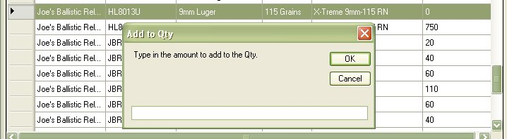

# Ammunition Inventory

The Ammunition Inventory will allow you to keep track of the ammunition that you have on hand.  This information also ties in with your firearm collection based on the Caliber Type.

To Access the Ammunition Inventory, you can either click on two bullets icon (  ) on the tool bar, or you can click on *View* | *Ammunition Inventory* from the menu bar.

Which will bring up the following window:

The Menu Bar was added in version 3.x

This toolbar was created to help manage your ammunition inventory, Here is a list of features that the tool bar has to offer:

*  - This will allow you to Add to the Qty of the Selected Ammunition.  Which Makes it easier then adding it up manually. See “*Adding to Qty of Selected Ammunition*” for more details.
*  - this will allow you to add Ammunition to the inventory list. See "*Adding Ammunition*" for more details.
*  - This will refresh the list of ammunition.
*  - This will allow you to delete the selected ammunition from the inventory. See "*Remove Ammunition from Inventory*" for more details.
* Total Rounds in Inventory" - This will just add up all the ammunition that you have listed in your inventory.
 

You can easily sort the information by click on the column's name/title.

This example is sorting by the Caliber Type just by clicking on the Cal header:

And this example if sorting by the Manufacturers Name just by clicking on the Manufacturer header:

In version 4.0 we where able to add the option to filter out data in a majority of the fields, mostly the ones that are commonly used.  You can usually spot these field when there is a down arrow located beside the column.  Below is an example of how to filter out by Caliber for 9mm:

For the ammunition inventory list, the manufacture, Cal, and grain columns are the ones that you will be able to filter out.

## Editing Ammunition Details

To Edit the information of the ammunition inventory, just double click on the field that you wish to edit.

In the Example above, we double clicked on the "Test Ammo" to change it to "Test Ammo2", we've also changed the grains and the quantity of the test ammo.   Once you edit the information you can move to the next row to edit that information or you can exit the form.

## Removing Ammunition from Inventory

To delete ammunition that is no longer in your collection/inventory, just highlight the row by click on the the gray bar beside the interested row.

Once you have the row selected, just hit your delete key to delete that information or click on the delete icon (  ) on the tool bar.

## Adding to Qty of Selected Ammunition

Click on the ammunition that you wish to add to, once you have one of the cells highlighted, click on the plus icon (  ) on the tool bar to bring up the following window.  The Example below will be adding the HL8013U, which till start off with nothing in stock.

Just type in the amount that you with to add to the current selected ammunition. and Click on the Ok Button.

Once you click on the *OK* button, it will refresh the Inventory list.

## Working With Ammunition Auditing.

When you have the Audit Ammunition Prices selected in your settings, you will see a few different options in the tool bar.

The Audit Menu Bar was added in version 4.0

This toolbar was created to help manage your ammunition inventory, Here is a list of features that the tool bar has to offer:

*  - This will allow you to Add to the Qty of the Selected Ammunition.  Which Makes it easier then adding it up manually. See “*Adding to Qty of Selected Ammunition*” for more details.
*  - this will allow you to add Ammunition to the inventory list. See "*Adding Ammunition*" for more details.
*  - This will refresh the list of ammunition.
*  - This will allow you to delete the selected ammunition from the inventory. See "*Remove Ammunition from Inventory*" for more details.
* Total Rounds in Inventory" - This will just add up all the ammunition that you have listed in your inventory.

## Adding to Qty of Selected Ammunition with Auditing Enabled

Adding additional ammunition to an existing listing is the same as it was before, but there are a few more things that you will have to input just to track the cost of that ammunition.  Click on the ammunition that you wish to add to, once you have one of the cells highlighted, click on the plus icon (  ) on the tool bar to bring up the following window. 

 

This form is based on the qty and price per box of ammunition that was purchased.   The next window will show that I will buy 2 boxes of 25 rounds for 6.99 each box of ammunition.

 

Once you enter in the information, click on the add button.  This will add the Qty times the number of boxes that you bought and update the Qty of the ammunition with the total.  It will also update the Audit list and put in 2 entries in the list, one for each box of ammunition.

 

