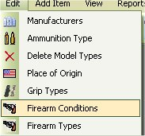
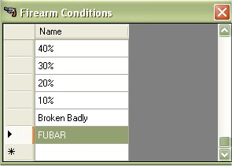
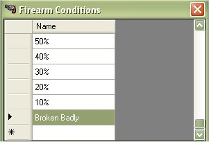

# Deleting Condition Types

Since the release of the My Gun Collection version 5.x, you are now able to manage, edit or delete the Condition Types of a firearm.  If you wish to edit the current information for the condition types, just click on "*Edit | Condition Types*"

Find the Condition that you wish to Delete and click on it once to select it.

now hit the Delete Key on the keyboard to delete the condition.

As you can see in the picture above, it is now gone.
