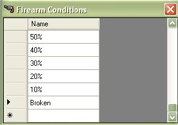
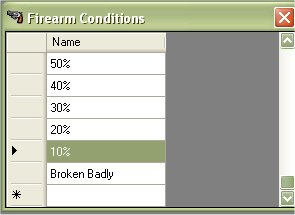
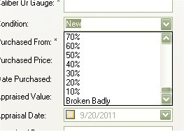

# Editing Condition Types

Since the release of the My Gun Collection version 5.x, you are now able to manage, edit or delete the Condition Types of a firearm.  If you wish to edit the current information for the condition types, just click on "*Edit | Condition Types*"

Find the Condition that you wish to edit and double click on it to start editing.

Once you are done making changes, just click on another field or hit your Enter key to save your changes.

Now when you are editing or adding a firearm, you will see the changes made in the condition menu.

