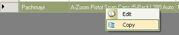
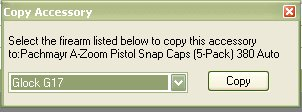
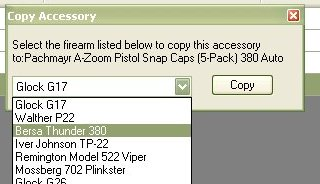
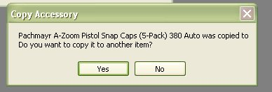

# Copying an Accessory

As you already know, when you are view the details of a selected firearm, you can add Accessories that go with that firearm.  From that same tab, you can now edit, copy and Delete items from that list.

While viewing the Accessories section for the selected firearm, click on the item that you are interested in to highlight the row, then right click on your mouse to bring down the following menu:

Select and Click on *Copy* to bring up the following window.

Click on the Down arrow to view the list of firearms that are in your collection

Once you have the firearm selected, click on the *Copy* button to continue.

A Message box will appear stating that the item was copied successfully.  From this window you can click on *No* to exit the form or you can click on *Yes* to copy it to another firearm.

