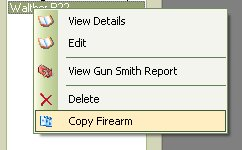
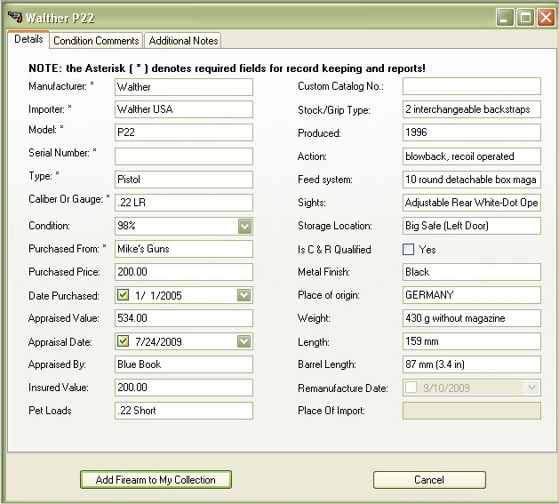
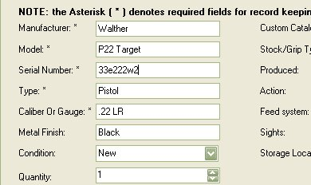
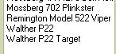
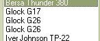
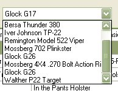

# How to Copy a Firearm

This section will tell you how to copy a firearm.  Sometimes we may get another or newer version of a firearm that we have in our collection.  Even though the specs for the firearm are pretty much the same, it is still a pain to fill out all the information again.  So to help with this issue, we added the ability to copy the details of a previous firearm.

At the Main screen, *Click* once to highlight the firearm that you wish to copy from the firearm list located on the left hand side..

Then *right click* on the selected firearm to bring up the following menu.

Click on *Copy Firearm* to bring up the following window:

As you can See this is the same as Clicking on the *Add Firearm* Button, except that it has copied all the information from the selected firearm to this new one.  All you have to do now is Type in the Serial Number and change any other information that you feel needs to be changed.

Once you are finished adding or correcting information, click on the *Add Firearm to My Collection* button to add this firearm to the collection.

**WARNING:  When you copy a Firearm that has the Same Model name, it will appear Twice on the Side list on the Main Window.**

This might cause issues if you had to quickly look up something and pull up the wrong firearm.  We recommend that you Add to the Model Name to help make it easy for you to recognize which firearm is which.

As shown in the Instructions above, I've added "Target" to the Walther P22 to help distinguish one from the other.

**If you had to Copy Accessories from the original firearm to the new one, make sure you know which one you are copying to.  One HINT that might help is that the Copy form for Accessories list the firearms in the order in which they where entered, so if I was going to copy an accessory from my first Glock to the new one, then I would have to select the last Glock in the list.  EXAMPLE:**

