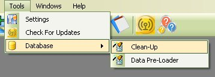
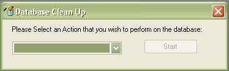
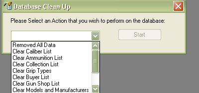

# Database Clean Up

The database clean utility was created to help wipe out the entire database of all the pre-loaded data.  You can have it perform a Remove All Data, which will wipe out everything, allowing you to start 100% fresh or you can select certain preloaded categories to remove from the database. 

If you already have your collection listed in the database and you just want to get rid of all the extra models and Manufacturers that you don't use then you can still use this utility.  We've also kept in mind that this might occur, so if it will also check to see if the Model, Manufacturers, Shops, Nationalities, Buyers, and Grip Types are not being used by the firearms currently listed in the collection, if they are it will leave it alone.

To access the Clean-Up Utility, just Click on Tools, Database, and Clean-Up, which will bring up the following window.

Just select the Clean-Up option from the drop down list.

You can select the Remove all Data