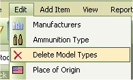
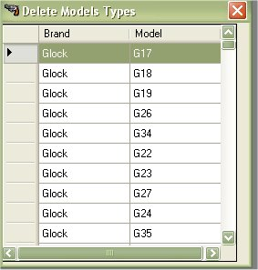
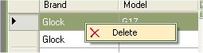
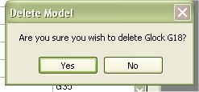
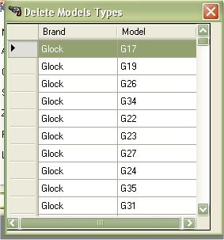

# Delete Model Types

This section will tell you how you can delete the Models that are stored in the database.  Since the MGC comes with a small list of Manufacturers and Models for the auto complete, this section will allow you to delete certain models that you are not interested in.  If you wanted to delete all the models listed, then we recommend using the [Database Cleanup Wizard](Database_Cleanup.md), which is a lot quicker.

To Access the Model List, Just click on *Edit | Delete Model Types*

Look through the list of Models that you wish to delete, then right click on the model to bring up the menu, select *Delete*.

When you click on Delete, it will confirm that you wish to delete the following model.

When you click on *Yes*, it will delete the selected model and refresh the list.

