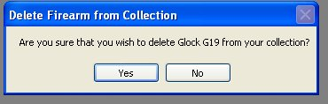
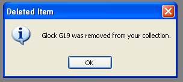
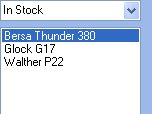

# Removing a Firearm from your Collection

Sometimes we all want to do a little house cleaning, and get rid of the things that are no longer needed.  You can quickly delete a firearm and everything that is tied to it (Accessories, Gun Smith Details, Maintenance Detail, and Pictures) from the database.

Just Select the Firearm that you want to delete and click on the Big Red X (   ) on the tool bar.

You will be asked if this is what you want to delete the select firearm from your collection, click on *Yes* if you are sure.

If you clicked on *Yes*, another message box will appear confirming that the selected firearm was deleted from the database.

Once you clic on the *Ok* button, the side list will update.  You will notice that the firearm is no longer listed.

