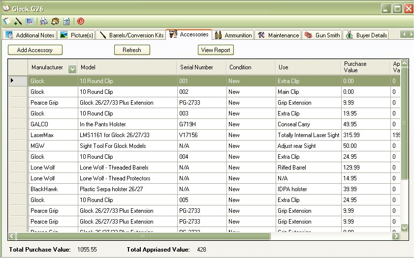

# Accessories

The Accessories section will list all the accessories that you have for that firearm.  This will allow you to keep track of the things that you have for this firearm, such as extra Magazines, Cases, Holsters, Sites, Scopes, Grips, Parts, etc...  You can also keep track of the price that you purchased that item for and what you use it for.  This is just to help see everything in one place. 

You can add an Accessory just by clicking on the [Add Accessory Button.](Adding_Acceeory.md)

## About the Firearm Details Tool Bar:

* _Offices_1_32x32.gif) - Allows you to edit the Details, Additional Notes and Condition Comments.
*   - Allows you to Print out the Details, Additional Notes, Condition Comments and the Default Picture.  To learn more about this report, see Firearm Full Detail Report
*  - Prints the same report as the Firearm Complete Detail Report, but it will also include: Accessories, Maintenance Details and Gun Smith Details. See Firearm Complete Detailed Report
*  - Will export all the everything the "Firearm Complete Detailed Report" report will into an XML File which will allow you Import to someone else's My Gun Collection software or for other purposes. See Importing/Exporting Firearm Details for more information
*  - This will close the current window.