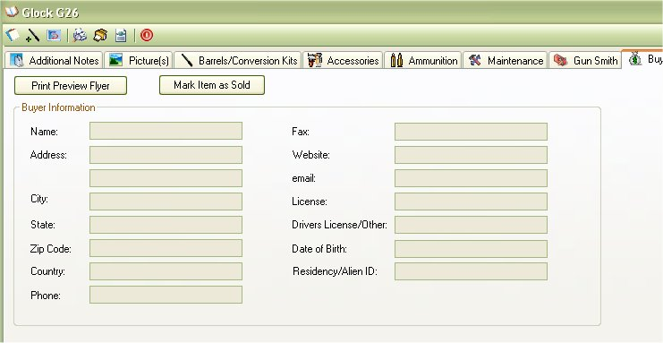

# Buyer Details

The Buyer Details is a quick view of who you sold this firearm to.   If you have not sold this firearm, the information will remain blank.  But just in case you did want to sell this firearm, we have created a few options for you.

The Print Preview Flyer button will create a printer friendly flyer for you to post up at the local gun shop or shooting range.  [Click here](Report_ForSale.md) for more information about the For Sale Flyer.

The Mark Item As Sold button will allow you to Mark this Item as sold and will also allow you to put in the Buyers information. [Click here](Adding_Buyer_Information.md) for more information on how to add a buyer and mark the firearm as Sold.

## About the Firearm Details Tool Bar:

* _Offices_1_32x32.gif) - Allows you to edit the Details, Additional Notes and Condition Comments.
*   - Allows you to Print out the Details, Additional Notes, Condition Comments and the Default Picture.  To learn more about this report, see Firearm Full Detail Report
*  - Prints the same report as the Firearm Complete Detail Report, but it will also include: Accessories, Maintenance Details and Gun Smith Details. See Firearm Complete Detailed Report
*  - Will export all the everything the "Firearm Complete Detailed Report" report will into an XML File which will allow you Import to someone else's My Gun Collection software or for other purposes. See Importing/Exporting Firearm Details for more information
*  - This will close the current window.