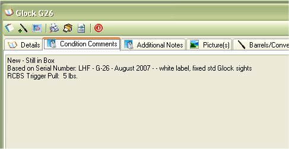

# Condition Comments

The Condition Comments section is a free form view of any thing that might be wrong with the firearm or deformations that it might have when you purchased the firearm or while it was in your possession.

To Edit or Add to the Comments Click on the *Edit Details* icon ( _Offices_1_32x32.gif) ) first icon in the tool bar., This will allow you to edit the details for the Condition Comments, Additional Notes and Details of the firearm.

## About the Firearm Details Tool Bar:

* _Offices_1_32x32.gif) - Allows you to edit the Details, Additional Notes and Condition Comments.
*   - Allows you to Print out the Details, Additional Notes, Condition Comments and the Default Picture.  To learn more about this report, see Firearm Full Detail Report
*  - Prints the same report as the Firearm Complete Detail Report, but it will also include: Accessories, Maintenance Details and Gun Smith Details. See Firearm Complete Detailed Report
*  - Will export all the everything the "Firearm Complete Detailed Report" report will into an XML File which will allow you Import to someone else's My Gun Collection software or for other purposes. See Importing/Exporting Firearm Details for more information
*  - This will close the current window.