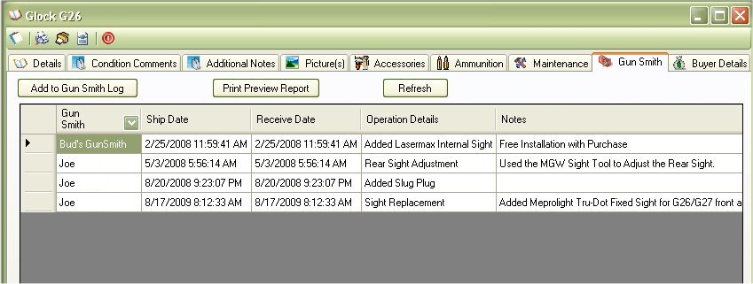

# Gun Smith Details

The Gun Smith Section will allow you to view the details of the when the gun was taken in to get fixed and what was done.  If you wanted  a full printable report for this section, just click on the [Print Preview Report](Report_GunSmith.md) to view and print this information.

To add a Log for this firearm, just click on the [Add to Gun Smith Log](Adding_To_GunSmith_Log.md) button to bring up the Add Gun Smith Log form.

## About the Firearm Details Tool Bar:

* _Offices_1_32x32.gif) - Allows you to edit the Details, Additional Notes and Condition Comments.
*   - Allows you to Print out the Details, Additional Notes, Condition Comments and the Default Picture.  To learn more about this report, see Firearm Full Detail Report
*  - Prints the same report as the Firearm Complete Detail Report, but it will also include: Accessories, Maintenance Details and Gun Smith Details. See Firearm Complete Detailed Report
*  - Will export all the everything the "Firearm Complete Detailed Report" report will into an XML File which will allow you Import to someone else's My Gun Collection software or for other purposes. See Importing/Exporting Firearm Details for more information
*  - This will close the current window.