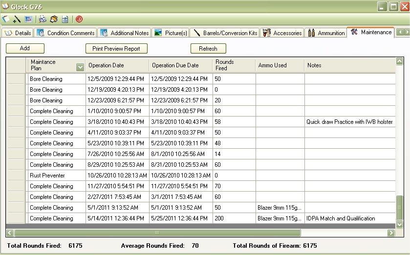

# Maintenance

The Maintenance window will display all the maintenance that you have done on the selected firearm since the time that you acquired it or since the time that you have been using this application. Adding maintenance details is useful if you want to take care of your firearms.  By keeping track of when you use it how you clean it after it is use is important to help maintain proper functionality of the firearm(s).  If you are a collector or regular shooter, then knowing when the last time the firearm was used, cleaned with a silicon cloth or oiled is important. 

In Version 3.x we've added what we like to call "Fun Stats".  It more of a quick and easy look to see totals and averages of the screen that you are viewing.   For the Maintenance section, we've added the ability to see the total number of rounds that have been fired from the selected firearm and even give the average of times that the firearm has been fired every time you use it.  This, of course, is based on the information that you provide by adding information in the Maintenance section.

To add information to the maintenance log, just click on the Add button to bring up then Add Maintenance Details window.  [Click here](Adding_Maintance_Details.md) for more information.

If you wanted to print out a report of this information, you can click on the Print Preview Report button. [Click here](Report_Maintenance.md) for more information about this report.

## About the Firearm Details Tool Bar:

* _Offices_1_32x32.gif) - Allows you to edit the Details, Additional Notes and Condition Comments.
*   - Allows you to Print out the Details, Additional Notes, Condition Comments and the Default Picture.  To learn more about this report, see Firearm Full Detail Report
*  - Prints the same report as the Firearm Complete Detail Report, but it will also include: Accessories, Maintenance Details and Gun Smith Details. See Firearm Complete Detailed Report
*  - Will export all the everything the "Firearm Complete Detailed Report" report will into an XML File which will allow you Import to someone else's My Gun Collection software or for other purposes. See Importing/Exporting Firearm Details for more information
*  - This will close the current window.