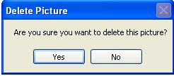
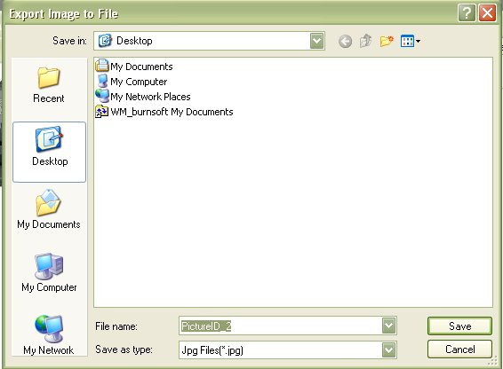

# Pictures

 The Pictures allow you to store and display pictures of your firearm, and or the accessories that you have for it. We do recommend that the first picture you put in is that of your firearm.  We only recommend this because the [For Sale Flyer](Report_ForSale.md) uses the first picture that was inserted.   In later versions will will try to make it were you can choose which picture to use, and or maybe more then one picture.

There is not much to the pictures at this time, you can Add, Delete and View Pictures from this section.

To View the picture, just double click on the picture to see the bigger version of it.

## Adding Pictured

To add a picture, just click on the Add button to bring up the following window:

Click on the Browse button to navigate to the folder that has your picture(s).

Select the Picture that you want to add by double clicking on it or by clicking it once, and then clicking on the Open button. Now the picture will appear in the Add Picture form:

All you have to do now is click on the Add button to add it to the database.

The Picture Name and Notes about the picture is optional.  But since the Version 5.x release we thought it would be useful to have notes and titles about the pictures, not only for your own reminders but also for the Gallery Report.

If you add a title and Notes, it will Also appear when put your mouse over the main picture.

If the icon of the picture does not show automatically, then click on the Refresh button to see if it applied.

## Deleting Pictures

To delete a picture just right click on the image you wish to delete to bring up the following menu:

Just Click on Delete to remove the picture from the database.

You will be asked if you are sure that you want to delete this picture, click on Yes if you are sure that you want to delete the selected picture.

## Exporting Pictures

When you are viewing the big version of the picture, you can export that image to your hard drive, or memory stick by right clicking on the picture and clicking on Export Picture.

Once you Click on Export Picture, a Save Dialog box will appear which will allow you to navigate to the location on where you wish to store this picture and the name that you want to give it.  By Default it will give the Picture the Name of the ID that is listed in the Database.

You can Also choose the type of picture that you wish to save it as.  The Default Picture Type is Jpg/JPEG.

Once you have a Location, Name and Picture Type set, click on the Save button to export the picture.  If the export was successful the following message box will appear stating that the export worked.

## Set as Main Image

The Set as Main Image feature was added to version 3.x.  This will allow you to select the picture that you wish to display on the For Sale Flyer.   This Default Image setup will also be used on any future reports that are created in later releases of the My Gun Collection application.  In previous versions, the first picture that you put in was the default image.

When you are viewing the big version of the picture, you can export that image to your hard drive, or memory stick by right clicking on the picture and clicking on Set As Main Image.

## Image Sizing Options

The Image Sizing Options where also release with Version 3.x.   In previous versions, when you click on the thumbnail to view the bigger version of the picture, it would stretch the image to the current screen size.  This wasn't a problem with most hand gun pictures, but when you started viewing pictures of rifles which are longer in width, it can be a bit annoying to constantly resize the picture.  So in version 3 we added the ability to give you the option on how you wish to view the pictures.  you can keep it stretched as in pervious versions or you can have it attempt to keep the ratio of the picture for the current view.

When you are viewing the big version of the picture, you can export that image to your hard drive, or memory stick by right clicking on the picture and clicking on Image and select either Original Size or Stretch.  You can also set that option of Original Size and Stretch in the Other Section located in the Settings window.

Stretched Picture Example ( what Version 1 and 2 looked like, and is now optional in version 3)

Attempt to keep the pictures ratio.

## About the Firearm Details Tool Bar:

* _Offices_1_32x32.gif) - Allows you to edit the Details, Additional Notes and Condition Comments.
*   - Allows you to Print out the Details, Additional Notes, Condition Comments and the Default Picture.  To learn more about this report, see Firearm Full Detail Report
*  - Prints the same report as the Firearm Complete Detail Report, but it will also include: Accessories, Maintenance Details and Gun Smith Details. See Firearm Complete Detailed Report
*  - Will export all the everything the "Firearm Complete Detailed Report" report will into an XML File which will allow you Import to someone else's My Gun Collection software or for other purposes. See Importing/Exporting Firearm Details for more information
*  - This will close the current window.