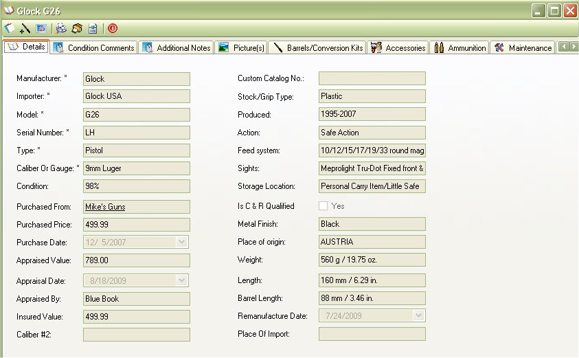

# View Details

 When you Double Click a firearm on the left hand side list, it will bring up the follow window.  From here you can view:

**[View Details](Details_View_Details.md):**

* [Condition Comments](Details_Condition_Comments.md)
* [Notes](Details_Notes.md)
* [Pictures](Details_Pictures.md)
* [Accessories](Details_Accessories.md)
* [Ammunition](Details_Ammunition.md) that you have in stock for that type of firearm.
* [Maintenance Details](Details_Maintenace.md) and logging
* [Gun Smith Details](Details_GunSmith.md) and logging
* [Buyer Details](Details_BuyerDetails.md)
 
The *Details* window will show you the information that you put in for that firearm, which are:

* Manufacturer - Company that made the firearm
* Importer - When the manufacturer is not based in the USA, there are companies that are allowed to buy their firearms and sell them in the US.  The importer is usually marked on the firearm.
* Model - The version of that firearm from that manufacturer.
* Serial Number - The number ID assigned to that firearm, each one is unique.  If there is not a serial number listed on that firearm, put in 0 as the number.
* Type - The type of firearm that it is; pistol, rifle shotgun, etc.
* Caliber or Gauge - The type of ammunition that it uses.  Also see Pet Loads.
* Condition - The current condition of that firearm, using NRA and Blue Book ratings.
* Purchased From - the person or shop that you bought this firearm from.
* Purchase Price - the price that you paid for the firearm
* Date Purchased - the date when the firearm was officially yours.
* Appraised Value - The value given by Blue Book or a Certified Appraiser.
* Appraised By - The method used to determine the Appraised Value ( Blue Book, Certified Appraisers Name, MSRP, etc).
* Insured Value - The value amount that your insurance will cover your firearm if lost or stolen.
* Pet Loads - Secondary ammunition type that can be used this firearm.   EXAMPLE: An AR-15 is made for 5.56 x 45mm NATO, but can also use off the shelf .223 Remington ammunition.
* Custom Catalog No. - A number created by you to track your firearm collection.
* Stock/Grip Type - Information about the stock is posted here. 
* Produced - The year that the firearm was produced.
* Action - The physical mechanism that manipulates cartridges and/or seals the breech.
* Feed System - The method of how ammunition is fed into the barrel
* Sights - The options available on how to aim the firearm
* Storage Location - The location of where you normally store this firearm.
* Is C&R Qualified - Firearms automatically attain curio or relic (C&R) status when they are 50 years old.  To see if your firearm is in the C&R list, check out the [BATFE](http://www.atf.gov/firearms/curios/index.htm) site.
* Metal Finish - Current coloring of the blue, stainless steel or chrome finish on the firearm.
* Place of Origin - The birth place of the first model
* Weight - The total weight of the firearm
* Length - The total length of the firearm
* Barrel Length - the total length of the barrel starting from the breech.
* Remanufactured Date - For firearms that were built one year, then disassembled, rebored, restocked and fitted for newer ammunition.
* Place of Import -  For firearms that are manufactured in one country then exported to another.

To Edit or Add to the Comments Click on the Edit Details icon ( _Offices_1_32x32.gif)  ) first icon in the tool bar., This will allow you to edit the details for the Condition Comments, Additional Notes and Details of the firearm.

## About the Firearm Details Tool Bar:

* _Offices_1_32x32.gif) - Allows you to edit the Details, Additional Notes and Condition Comments.
*   - Allows you to Print out the Details, Additional Notes, Condition Comments and the Default Picture.  To learn more about this report, see Firearm Full Detail Report
*  - Prints the same report as the Firearm Complete Detail Report, but it will also include: Accessories, Maintenance Details and Gun Smith Details. See Firearm Complete Detailed Report
*  - Will export all the everything the "Firearm Complete Detailed Report" report will into an XML File which will allow you Import to someone else's My Gun Collection software or for other purposes. See Importing/Exporting Firearm Details for more information
*  - This will close the current window.