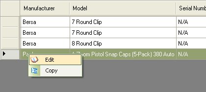
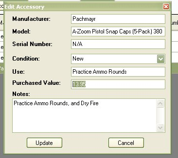
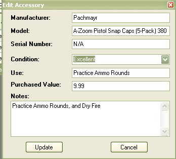
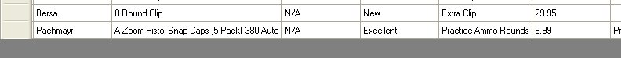

# Editing an Accessory

As you already know, when you are view the details of a selected firearm, you can add Accessories that go with that firearm.  From that same tab, you can now edit, copy and Delete items from that list.

While viewing the Accessories section for the selected firearm, click on the item that you are interested in to highlight the row, then right click on your mouse to bring down the following menu:

Select and Click on Edit to bring up the following window

Type in the changes that you wish to make.

Then click on the Update button to save and exit the form.

Now the Accessory listing has been updated.