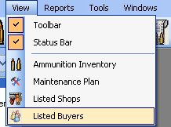
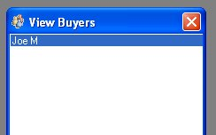
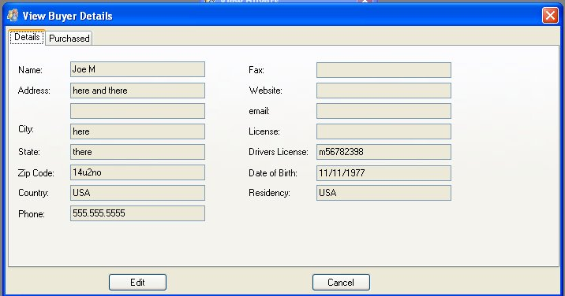
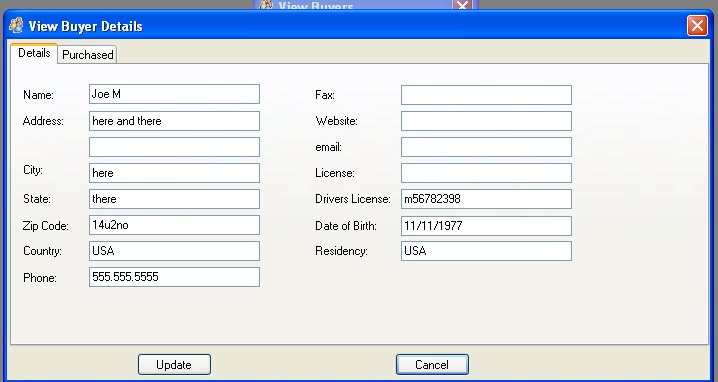
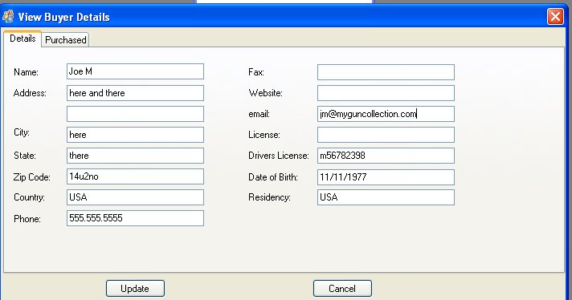
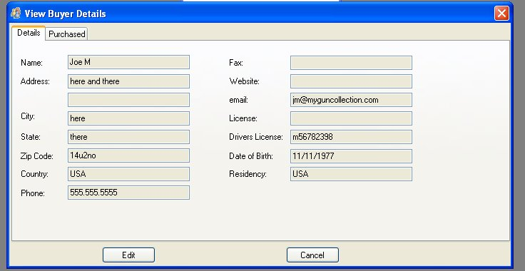

# Edit Buyer Details

Since this application is keeping track of who you sold your firearm to, we thought it was best to make a quick and easy way to view the people that have bought your firearms.

To Access the Buyers list just Click on View on the menu bar and then click on Listed Buyers, to bring up the following window.

Double click on the Buyers Name to view more information:

Just Click on the Edit button to Edit the details:

Now you can edit or add information to the Buyer Details

Once you are finished adding or editing the buyer's details, just click on the Update button to apply the changes.

