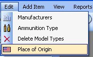
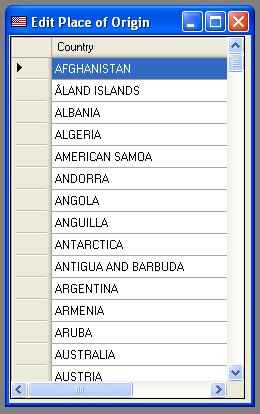
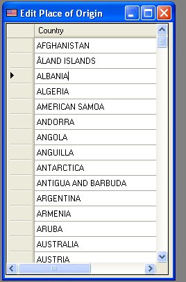
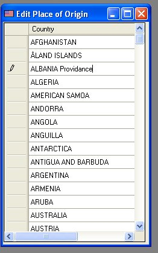

# Editing Place of Origin

To edit and view the Place of Origin list, just click on Edit and Click on Place of Origin

Just scroll through the list, once you find the nation or country that you want to edit, just double click on the name to edit the name.

The First Click will highlight the name, now you can either add to the name or completely rename it.

You can either click on another name to edit it, or you can close the window to finish editing.

