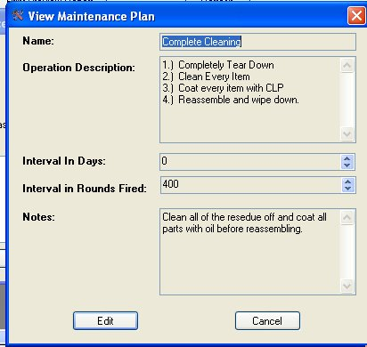
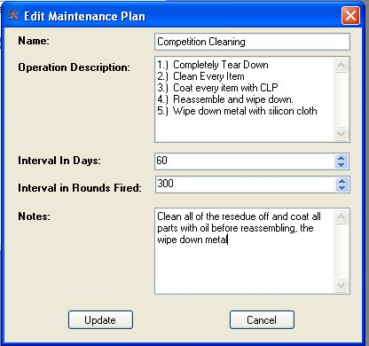
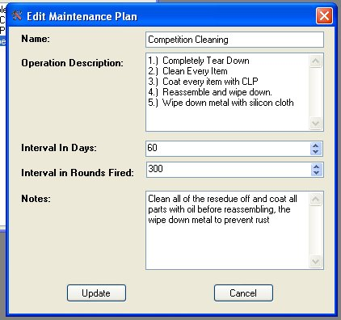
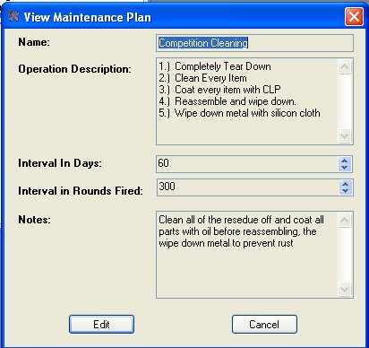

# Editing a Maintenance Plan

When you are viewing the details on the Maintenance Plan, you can click on the Edit button to change the information in the Plan.

Change or add the Information that you desire.

Once you are finished updating the information, click on the Update button to apply to save the information to the database.

