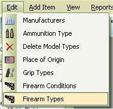

# Adding Firearms Types

Since the release of the My Gun Collection version 5.x, you are now able to manage, edit or delete the Firearm Types of a firearm.  If you wish to edit the current information for the firearm types, just click on "Edit | Firearm Types"

Scroll down to the bottom on the list Till you get to the Last line with the * beside it.

Double click on the whitespace, to start adding a new type.

Once you are done, hit your Enter key or click on the field above to save your new addition.

Now when you are editing or adding a new firearm, your new type will be listed.

