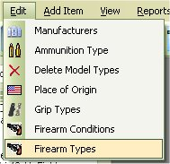
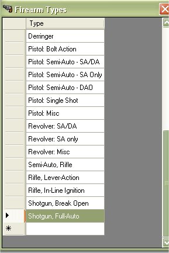
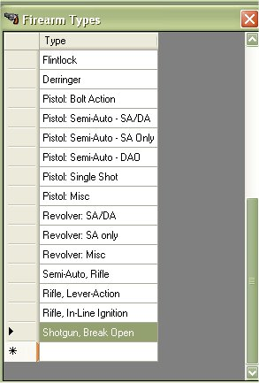

# Deleting Firearms Types

Since the release of the My Gun Collection version 5.x, you are now able to manage, edit or delete the Firearm Types of a firearm.  If you wish to edit the current information for the firearm types, just click on *"Edit | Firearm Types"*

Find the Type that you wish to Delete and click on it once to select it.

now hit your Delete Key to delete the type.

As you can see in the picture above, it is now gone.

