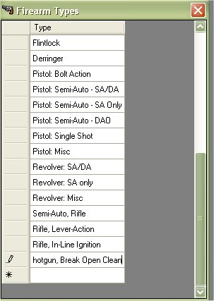
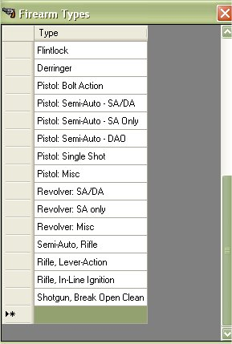

# Editing Firearms Types

Since the release of the My Gun Collection version 5.x, you are now able to manage, edit or delete the Firearm Types of a firearm.  If you wish to edit the current information for the firearm types, just click on "*Edit | Firearm Types*"

Find the Type that you wish to edit and double click on it to start editing.

Once you are done making changes, just click on another field or hit your Enter key to save your changes.

