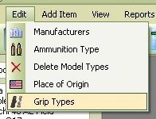
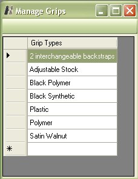
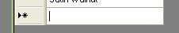
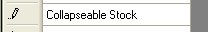
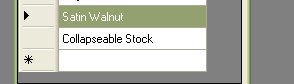
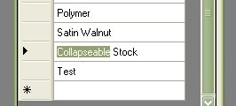
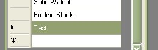
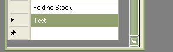
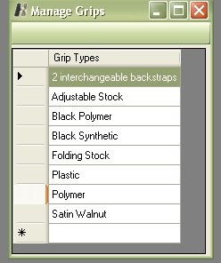

# Managing Grip Types

Since the Grips Types are stored in the database and are mostly used when adding a firearm, we have now added the ability for you to be able to edit, delete and add Grip types to the database.

On the Menu bar of the main window, just click on Edit and Grip Types to bring up the following window.

From this Window you can add, edit or delete a grip type from the database.

## Adding a Grip Type

To Add a grip type is pretty easy, just click on the empty field at the bottom of the list, this field usually has a asterisk ( * ) next to it.

Type in the new Grip Type, Once you are finished hit your Enter key or click on another area in the viewing window.

## Editing A Grip Type

Editing an item is just as easy as adding an item, Just double click on the item of interest to start editing.

Make your changes, Once you are finished hit your Enter key or click on another area in the viewing window.  In the Example above we are going to rename the collapsible stock to folding stock.

## Deleting a Grip Type

Deleting a Grip Type is just as easy as adding or editing.  Just click once on the item that you wish to delete.

Once you have the item selected, as shown above, just click on your Delete/ DEL key. Now it no longer exists in the database.

**NOTE:  This method of deleting/removing a Grip Type from the Collection is not as smart as using the Database Clean-up utility.  This will delete it even if it is in use by one of your firearms.  We heavily recommend that run the Database Clean-Up utility to remove all the Grip Types that are not Used in your collection if you wish to remove grip types that are not in use in your collection.**