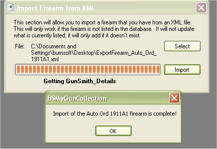

# Importing/Exporting Firearm Details

The ability to Import and Export the Detail of a firearm was created to allow users to export the firearm's details, accessories, maintenance, and gun smith details to a XML file, which can be used to import into another database, application or on the web. 

Our main goal on this feature, was to give the users the ability to give such information to the buyer or seller of the firearm.  If you sold a firearm to someone and they used the My Gun Collection application to track their collection as well, then you can give them this XML file and they can import it into their collection, and vise versa.  This will allow you and/or the buyer the ability to have the firearm's past and current details.  If a firearm was known to need certain parts replaced after x many rounds have been past through it, wouldn't it be nice to know how many rounds where in it before you bought it?  The option to export and import this history can help with this issue.

## Exporting

To Export the information from a firearm, click on the firearm that you are interested in view the details of that firearm.  When the details window comes up, you can click on the XML icon (  ) on the tool bar to start the export process.

Select the location that you wish to save this file, and click on the Save button.

When it is complete, you will get the following message:

you can go to the location that you saved the file and click on it to open it to view the following information:

## Importing

To Import a firearm to your collection, just click on File | Import Firearm from the main window to bring up the following window:

Click on the Select button to select the file that you wish to import.

Once you have selected the file that you wish to import, click on the Open button.

Now that we have a file selected, click on the Import button to add the information to your collection. Once it is complete you will see the following message.

Click on the OK button to exit the Import window.   Now when you look at the firearm list, you will see that firearm.