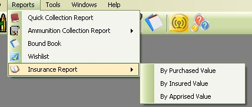
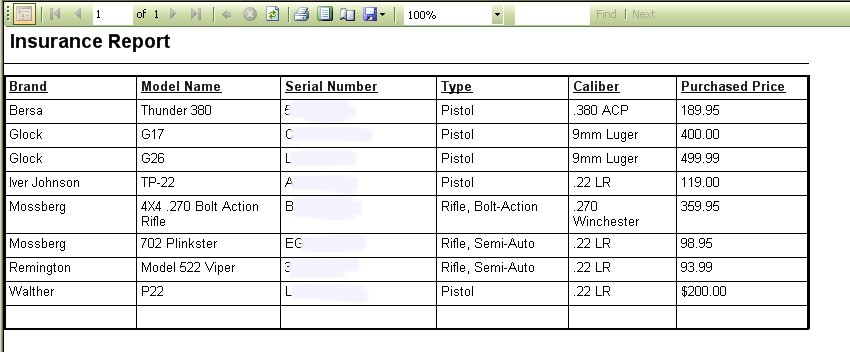
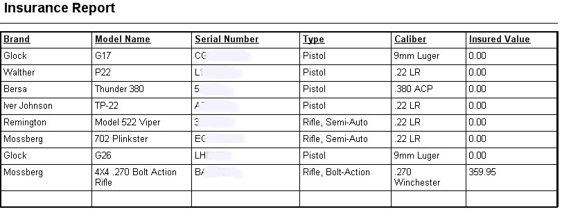
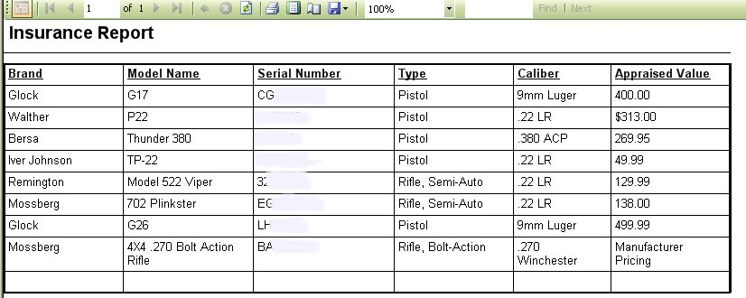

# Insurance Reports

The Insurance reports are like the Quick Inventory Print out Reports, except that will include the Purchased, insured value or appraised value of the firearm.
You can access the reports by clicking on Reports | Insurance Reports | Select the Report that you wish to view.  Here are the following options that you have for the report:

* By Purchased Price
* By Insured Value
* By Appraised Value.

Below are samples of the Reports listed above.

## By Purchased Price

## By Insured Value

## By Appraised Value

