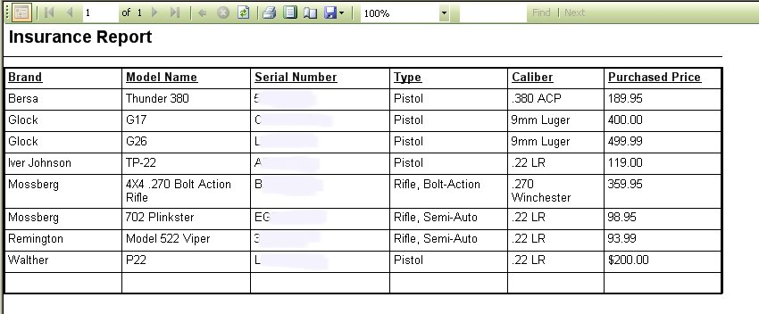

# Insurance Reports with Total

The Insurance reports with Total is the same as the regular Insurance Report, except that the total of all the firearms in your collection are added at the end of the report.

You can access the reports by clicking on Reports | Insurance Reports with Total | Select the Report that you wish to view.  Here are the following options that you have for the report:

* By Purchased Price
* By Insured Value
* By Appraised Value.

Below are samples of the Reports listed above.

At the end of each report there is a total of the price/value of all of your firearms.

## By Purchase Price

## By Insured Value

## By Appraised Value

