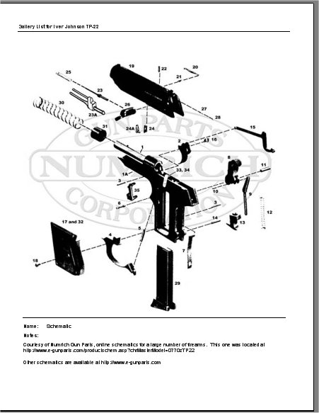
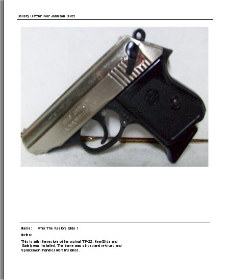

# Report - Firearm Picture Gallery

While you are viewing the collection details of a firearm, you have always been able to view the pictures that you have taken for that firearm, by clicking on the Pictures Tab, In version 5.x, we added the ability to tag your pictures with titles and details.   Also with that we have created another report that will print out all the pictures, titles and notes that belong to the firearm that you are viewing, just click on the button call View Gallery Report to bring up the following report to view or to print.

As you can see it is how the report will look when you print it out.  To print out the report, just click on the Printer icon (  ) that is located on the menu bar on the report, once you click on that the Print Options will appear:

Of course you also have the option to save the report to an Excel or PDF file.  To Learn more [Click here](exporting_reports_to_file.md).