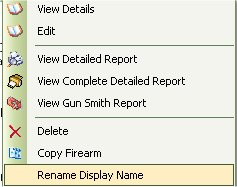

# Firearm Complete Detailed Report

The FirearmComplete Detailed Report is a printer friendly way of printing out all the specs for the selected firearm. It's the same as the [Full Detailed Report](report_fulldetails.md), but it will include more.  It will use the first picture or default picture that you assigned to that firearm as the display picture, then it will print out all the details that you would first see when you click on the firearm. It will also include all the Accessories, Maintenance and Gun Smith Details that has occurred. 

To view this report, you can either click on the firearm in the main list, and right click to bring up the following menu:

And select View Complete Detailed Report to view the report listed below.  Or while you are viewing the details of the firearm, you can click on the brown printer icon (  ) in the tool bar to view the following report.

As you can see it is how the report will look when you print it out.  To print out the report, just click on the Printer icon (  ) that is located on the menu bar on the report, once you click on that the Print Options will appear:

Select the Printer that you want this report to go to, and click on the Print button.  And that's it!

Of course you also have the option to save the report to an Excel or PDF file.  To Learn more [Click here](exporting_reports_to_file.md).

