# Custom Reporting

The ability to do custom reporting didn't come about until version 3.1.  The custom reports are not as nice as the stock reports that come with the My Gun Collection application due to some customization that we had to do in order to provide custom reports, but they are still pretty effective depending on what you wish to report on.  The Custom Reporting option is new to this application so we are sure there will be future fixes for this section.

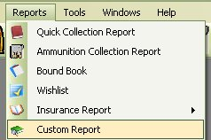

To Access the Custom Reports, Just Click on Reports then Custom Report from the menu at the top of the main screen.

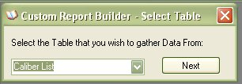

The first window that comes up will be the Select Table window, which will list some of the tables that you Can create reports on.  If this is your first report and you do not have any saved reports the window will look like the picture above, otherwise, if you have reports that are saved, then this is what the window will look like.

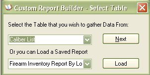

Just click on the Down arrow on the first combo box to view the list of tables that you can create a report on.

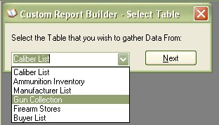

For this Example, we are going to create a report from the Gun Collection Details.   Once you have selected the Table that you want to create a report on, click on the Next button to go to the next window.

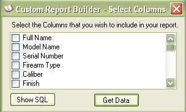

The Select Columns window will allow you to pick the fields that you wish to display in your report, just select the fields by clicking on the checkbox next to each field

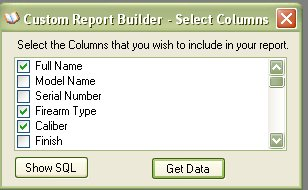

Once you are finished, click on the Get Data Button to view the results

**NOTE: ABOUT SHOW SQL BUTTON.**  

The Show SQL button will allow you to see or modify the SQL Statement that is used to create the results in the next window.  If you know how to create SQL statements, then this might be useful to you.  The SQL Statements is what is stored for the Saved Report functions, so if you make a SQL Statement that is not a stock statement (meaning you use the interface to create it), it still could be saved so you don't have to do it again.

When you click on the Show SQL button, it will expand the window above to the following window.

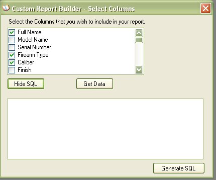

When you click on the Generate SQL button, it will display the following information.

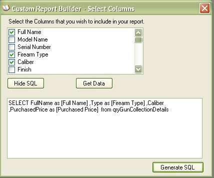

From here you can modify the statement to your liking.  Once you are finished, click on the Get Data Button to view the results

As you can see in the picture below, displayed are the results from the information that you have asked for.

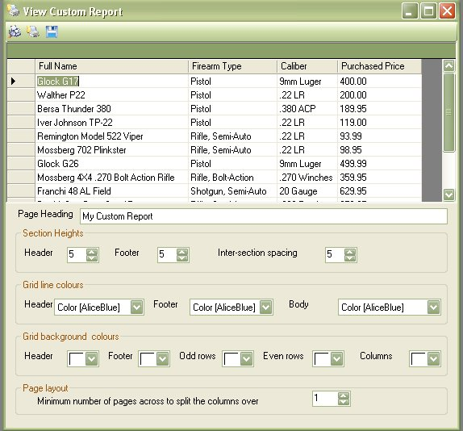

The Tool Bar   currently Has 3 Options, Page Setup, Print Preview and Save..in that order.

## Page Setup

Sometimes the results might span off the page onto the next page, which is when you will have to use the Page Setup and tell it to use Landscape or you might have to mess with another setting.

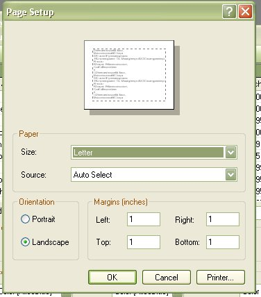

## Print Preview

The Print Preview button will let you see how the report will look before you send it off to the printer.

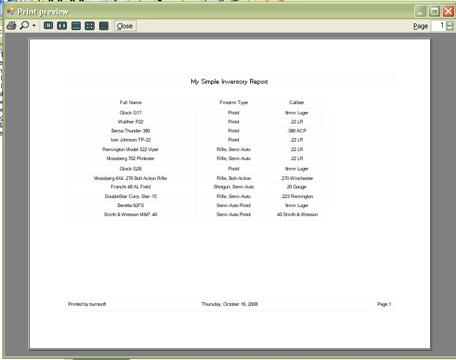

This will allow you to see if you have to make any changes to the Page Setup before you print it out.

You can Also use the Section Height, Grid Line Colors Grid Background Colors, and Page layout at the bottom of the results window to format the report on preview.

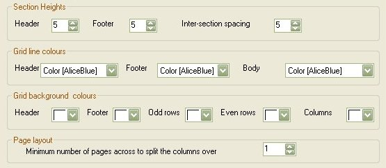

## Save

You can Save the SQL statement and the Title of the report by clicking on the Save Icon (  )

If it is a new report that you are saving it will tell you that the report was saved.

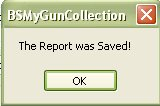

It uses the Page Heading as the reference for the save.

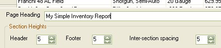

If you try to save the report using the same name of an existing report, it will ask you if you wish to overwrite the existing report, just click on the Yes button to overwrite.

## Accessing Saved Reports

Once you have a report saved to the database, when you first access the Custom Reporting Window, you will be presented with the option of creating a new report, or you can select a report which will allow you to view the results.

## Exporting Reports

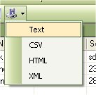

The Regular Reports will allow you to export the reports to an Excel file or PDF File.   In order to try and keep the custom reports up to par with the Stock reports and remain in compliance with BATFE regulations on being able to save the information to a computer file, we added the ability to export the custom report to Text, CSV, HTML or XML file formats.

