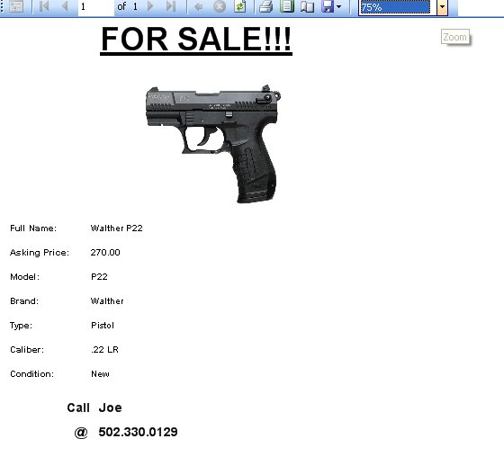

# Firearm For Sale Flyer

The For Sale Flyer is a printer friendly way of printing out a For Sale Flyer for the selected firearm.  It will use the first picture that you assigned to that firearm as the display picture, next it will list the Full Name of the Firearm, the Asking Priced (Which is based off the Apprised Priced), the Model, Brand/Manufacture, the Type, Caliber, and Condition of the firearm.  It will Also use the Name and Phone number that you supplied for the personal information when you first started the program (See Settings for more information on personal info).  To get the Flyer, just go to the Buyer Details section on the firearm details, and click on the Print Preview Flyer to bring up the following window:

As you can see it is how the report will look when you print it out.  To print out the report, just click on the Printer icon (  ) that is located on the menu bar on the report, once you click on that the Print Options will appear:

Select the Printer that you want this report to go to, and click on the Print button.  And that's it!

Of course you also have the option to save the report to an Excel or PDF file.  To Learn more [Click here](exporting_reports_to_file.md).

