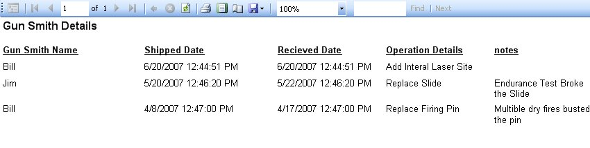

# Gun Smith Details Report

The Gun Smith Retails Report is a printer friendly way of printing out the Gun Smith Details for the selected firearm.  If you also have print outs of each firearm in folders, this will allow you to put this report for that firearm.  To get the Report, just go to the Gun Smith section on the firearm details, and click on the Print Preview Report to bring up the following window:

As you can see it is how the report will look when you print it out.  To print out the report, just click on the Printer icon (  ) that is located on the menu bar on the report, once you click on that the Print Options will appear:

Select the Printer that you want this report to go to, and click on the Print button.  And that's it!

Of course you also have the option to save the report to an Excel or PDF file.  To Learn more [Click here](exporting_reports_to_file.md).

