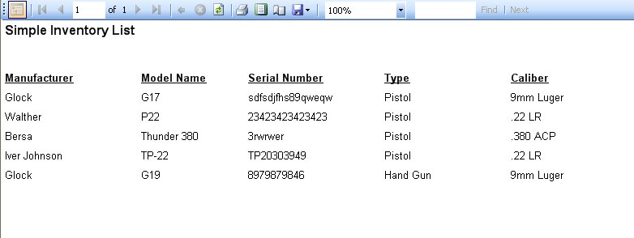

# Simple Inventory Report

The Simple Inventory List will give you a list of the firearms in your collection.   This will display the Manufacture, model Name, Serial Number, Type, and Caliber.   To Access this report, just click on Reports on the menu bar, and click on Quick Collection Report.

As you can see it is how the report will look when you print it out.  To print out the report, just click on the Printer icon (  ) that is located on the menu bar on the report, once you click on that the Print Options will appear:

Select the Printer that you want this report to go to, and click on the Print button.  And that's it!

Of course you also have the option to save the report to an Excel or PDF file.  To Learn more [Click here](exporting_reports_to_file.md).

