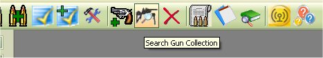
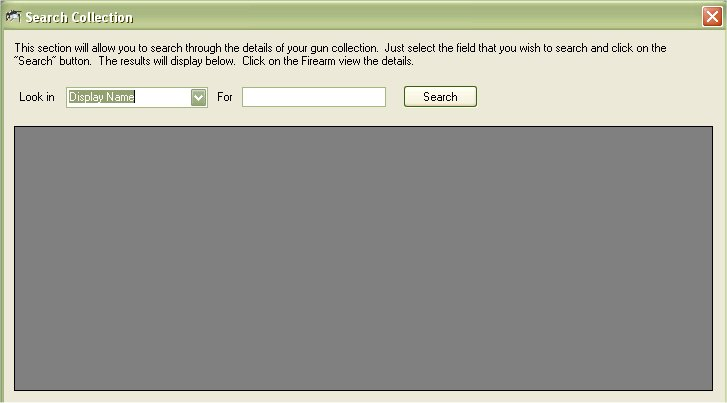
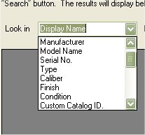
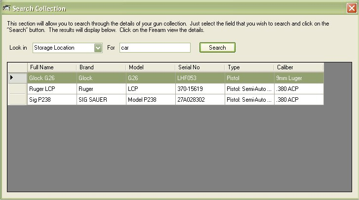
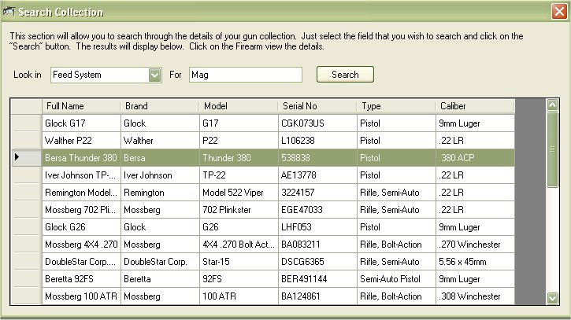

# Searching Your Collection

In version 5.x, we added the ability for you to search for a firearm(s) that machine the criteria that you are looking for.
Just click on the icon from the main tool bar that looks like a rifle with a magnifying glass to bring up the search window.

The "Look In" drop down box will contain the fields that you can search in.  Just select the field that you wish to search in.

Type in the phrase that you wish to look for and click on the "Search" button.  It will search that field for anything that matches that word or phrase.

From there, just double click on the firearm to view the details.

