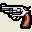
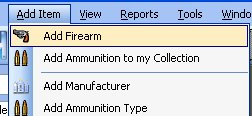
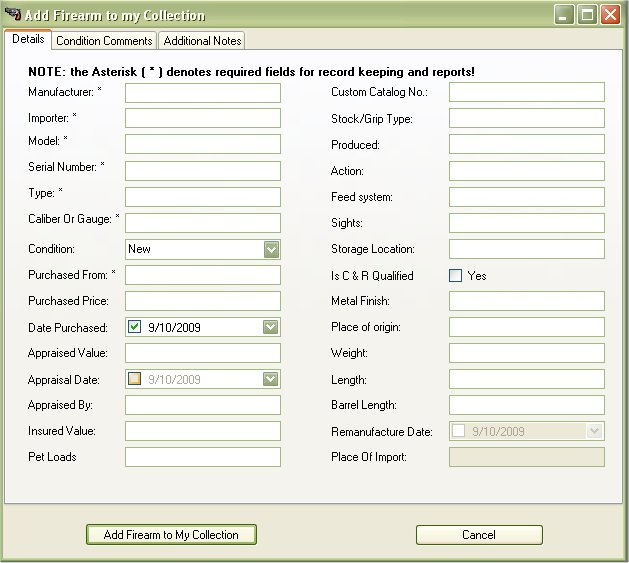
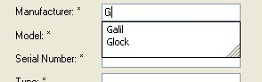
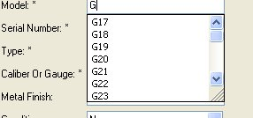
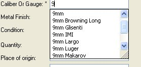
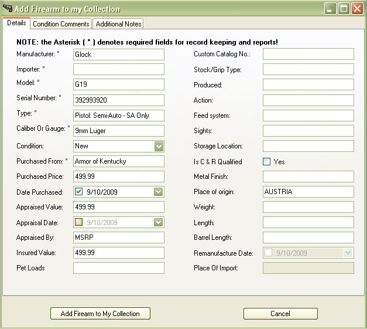

# Starting Out - Adding a Firearm

You can add one of your firearms to the application by clicking on the the Add Item then Add Firearm  from the menu of by clicking on the Gun Icon (  ) on the Tool Bar.

Once you click on that, it will bring up the following window.  Fill in the Fields that have the asterisk ( * ) by them

The only thing that is required is the manufacture, model, Serial Number, Type, and Caliber.  The rest of the information is something that you in fill in later is you want. One of the things that we added in was the Auto Suggest feature on most of the fields. For example, on the Manufacture, if you have a Glock, Type in G, and all the Manufactures that are listed that start with G will appear.

Same applies to the Model, we have added in a number of Glock models in the database.   Since most of them Start with a G as well, all the models will appear if you type in a G.

All of the ammunition types have been pre loaded in the database.  For 9 mm's all you have to do is type in ( and all the (mm types will appear for your choosing.

If there is something that we do not have listed in the database, You can still type it in and it will have it for another time, if you where to get another model of the same type it will appear next time around.  We tried to preload as much information on the Manufactures, Models, and Ammunition to the database to help ease the use of this application for you.

NOTE: The Following information is a brief description about the use of the fields in the Add Firearm Form. Going down the list starting from the left hand column.

**The Details Tab**

* Manufacturer - Company that made the firearm
* Importer - When the manufacturer is not based in the USA, there are companies that are allowed to buy their firearms and sell them in the US.  The importer is usually marked on the firearm.
* Model - The version of that firearm from that manufacturer.
* Serial Number - The number ID assigned to that firearm, each one is unique.  If there is not a serial number listed on that firearm, put in 0 as the number.
* Type - The type of firearm that it is; pistol, rifle shotgun, etc.
* Caliber or Gauge - The type of ammunition that it uses.  Also see Pet Loads.
* Condition - The current condition of that firearm, using NRA and Blue Book ratings.
* Purchased From - the person or shop that you bought this firearm from.
* Purchase Price - the price that you paid for the firearm
* Date Purchased - the date when the firearm was officially yours.
* Appraised Value - The value given by Blue Book or a Certified Appraiser.
* Appraised By - The method used to determine the Appraised Value ( Blue Book, Certified Appraisers Name, MSRP, etc).
* Insured Value - The value amount that your insurance will cover your firearm if lost or stolen.
* Pet Loads - Secondary ammunition type that can be used this firearm.   EXAMPLE: An AR-15 is made for 5.56 x 45mm NATO, but can also use off the shelf .223 Remington ammunition.
* Custom Catalog No. - A number created by you to track your firearm collection.
* Stock/Grip Type - Information about the stock is posted here. 
* Produced - The year that the firearm was produced.
* Action - The physical mechanism that manipulates cartridges and/or seals the breech.
* Feed System - The method of how ammunition is fed into the barrel
* Sights - The options available on how to aim the firearm
* Storage Location - The location of where you normally store this firearm.
* Is C&R Qualified - Firearms automatically attain curio or relic (C&R) status when they are 50 years old.  To see if your firearm is in the C&R list, check out the BATFE site.
* Metal Finish - Current coloring of the blue, stainless steel or chrome finish on the firearm.
* Place of Origin - The birth place of the first model
* Weight - The total weight of the firearm
* Length - The total length of the firearm
* Barrel Length - the total length of the barrel starting from the breech.
* Remanufactued Date - For firearms that were built one year, then disassembled, rebored, restocked and fitted for newer ammunition.
* Place of Import -  For firearms that are manufactured in one country then exported to another.

**Condition Comments Tab**

This is a free form text box that will allow you to write about the condition of the firearm, if any observations in condition need to be made to identify or appraise your firearm. 

**Addition Notes Tab**

This is another free form text box that will allow to add misc. information about your firearm.  Such as the product description of the firearm from the manufacturers website.

Once you have the default information, you can click on the Add Firearm to My Collection button to add the firearm to this application.  The rest of the information, you can fill out now or later.  Once you click on the  Add Firearm to My Collection button, the name will appear on the side listing.

And that is all to add a firearm to your collection.
